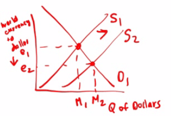

# Question 2

  -   **Real GDP = Nominal GDP - Inflation**

  -   **Real interest rate = Nominal interest rate - Inflation rate**

# Question 6

  -   AD↑ = Y↑ = C + I↑ + G + NX

![Factors That Shift the Aggregate Demand Curve Changes in expectations
If consumers and firms become more optimistic, . If consumers and firms
become more pessimistic, Changes in wealth If the real value of
household assets rises, . If the real value of household assets falls, .
Size of the existing stock of physical capital If the existing stock of
physical capital is relatively small, . If the existing stock of
physical capital is relatively large, Fiscal policy If the government
increases spending or cuts taxes, . If the government reduces spending
or raises taxes, . Monetary policy If the central bank increases the
quantity of money, . If the central bank reduces the quantity of money,
.. aggregate demand increases. aggregate demand decreases. aggregate
demand increases. aggregate demand decreases. aggregate demand
increases. ... aggregate demand decreases. aggregate demand increases.
aggregate demand decreases. aggregate demand increases. ... aggregate
demand decreases. ](./media/image22.png)

# Question 13

<table>
<thead>
<tr class="header">
<th></th>
<th>Contractionary</th>
<th>Expansionary</th>
</tr>
</thead>
<tbody>
<tr class="odd">
<td>Monetary</td>
<td>
Discount Rate ↑

Federal Funds ↑

= Sell Government Security

RRR↑
</td>
<td>
Discount Rate ↓

Federal Funds ↓

= Buy Government Security

RRR↓
</td>
</tr>
<tr class="even">
<td>Fiscal</td>
<td>
Taxes↑

Government Spending↓

Government Transfer↓
</td>
<td>
Taxes↓

Government Spending↑

Government Transfer↑
</td>
</tr>
</tbody>
</table>

# Question 21

  -   Consumption function

  -   **Increases** in **MPC** will **increase** the equilibrium level
      of both **income** and **consumption**

# Question 24

  -   **National Income↑ → Spending on goods and services↑ → Demand for
      money↑**

# Question 25

  -   The Keynesian **aggregate supply curve** is **horizontal**,
      indicating that firms will supply **whatever amount** of goods in
      demanded at the existing price level

  

# Question 29

  

# Question 34

  -   **Classical economics** (also known as **liberal economics**)
      asserts that markets function best with **minimal government
      interference**.

  -   Classical economists observe that **markets** generally **regulate
      themselves**, when free of coercion.

# Question 36

  -   **Equilibrium output < Potential output: Recessionary gap**

  -   **Equilibrium output > Potential output: Inflationary gap**

  -   **Spending Multiplier = 1/(1-MPC)**

  -   **Tax Multiplier = -MPC/(1-MPC)**

# Question 40

  

  -   If the public decides to **increase** its holdings of
      **currency**, the **interest rate** will **increase**

# Question 41

  -   An increase in **government expenditure** will **lower** the
      **interest rate**, causing **less investment** (Crowding-out
      effect)

# Question 43

  -   **Supply shock**: Aggregate Supply Curve shifts to the **left**

  -   Supply shock will change both **relative** prices and the
      **general** price level

# Question 44

  -   unemployment fell = rGDP increase

  -   inflation fell = Price level fell

  

# Question 48

  -   An **increase** in the **labor foece participation rate** will
      make it **more diffficult** to **reduce unemployment**, since the
      number of labors has increased

# Question 49

  -   British economist John Maynard **Keynes** spearheaded a revolution
      in economic thinking that **overturned** the then-prevailing idea
      that free markets would **automatically** provide **full
      employment**—that is, that everyone who wanted a job would have
      one as long as workers were flexible in their wage demands

# Question 51

  -   The most important **determinant** of **saving and consumption**
      is the **level of income**

# Question 52

  -   If the interest rate is already low, increasing money supply will
      not be effective as in the high interest reate.

  -   If the employment is already high, it's hard to improve it further
      to increase rGDP.

  -   **Nothing to improve = no effect on GDP**

  -   **A lot to improve = greatest effect on GDP**

# Question 55

  -   Gold is not part of the money supply

  -   M1
    
      -   Cash
    
      -   Money in checking accounts
    
      -   Traveler's checks

  -   M2
    
      -   All money in M1 plus "near-moneys"
    
      -   Saving accounts
    
      -   Certificate of Deposits
    
      -   Money Market Funds