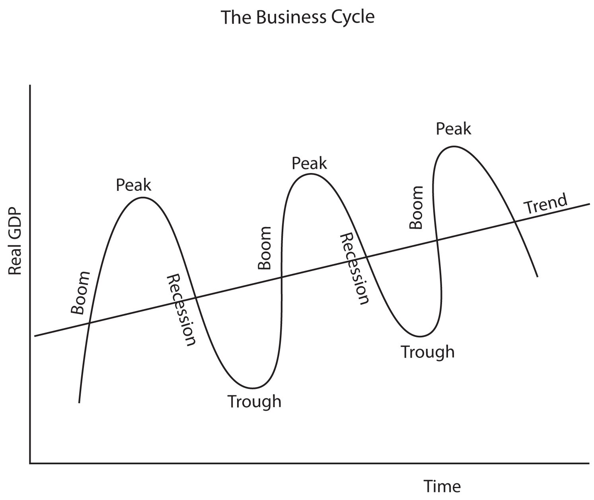
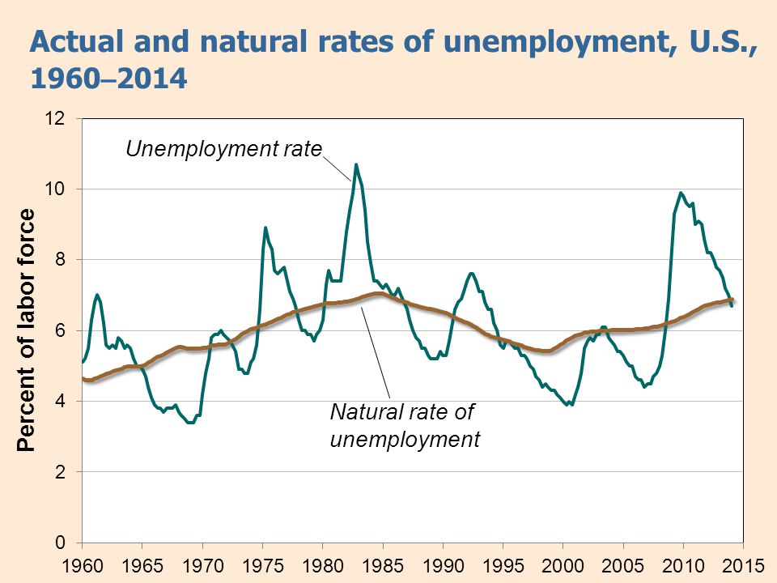

# Unemployment Measures

  -   Am I unemployed?

  

  -   Employed
    
      -   people currently **holding a job** in the economy (either
          full-time or part-time)

  -   Unemployed
    
      -   people who are **actively looking for** work but have **not
          found** a job

  -   Labor Force
    
      -   sum of **employed** and **unemployed **

  -   Labor Force Participation
    
      -   **percentage** of the population 16 or older that is in the
          labor force

  

  -   Unemployment rate
    
      -   defined as the **percentage** of total number of people in the
          **labor force** (employed + unemployed) who are **unemployed**

  

  -   Example

  

  -   Unemployment rate = (14.3 / 154.2) × 100 = 9.3 percent

  -   Labor-force participation rate = (154.2 / 235.9) × 100 = 65.4
      percent

<!-- end list -->

  -   Is it possible for the unemployment rate to increase and yet be a
      positive sign for the economy? Explain
    
      -   Increase in unemployment could be a positive sign for the
          economy
    
      -   The number of employed labor also depends on the Labor Force
          Participation Rate

# Limitation of the Unemployment Rate

  -   Unemployment tends to **understate** the employment situation
      because you are unemployed only if you have been **actively
      looking for** labor

  -   Marginally attached to labor force
    
      -   Not in labor force, wanted and were available for work in
          prior 12 months but had **not searched for work** in the 4
          weeks preceding BLS survey

  -   Discouraged worker
    
      -   part of marginally attached workers who **give up** because
          they **believe no jobs** are available for them

  -   Underemployed
    
      -   workers who **would** like **full-time** jobs **but** are
          working **part-time** or someone who is **overqualified** for
          his job position

# Types of Unemployment

  -   Frictional unemployment
    
      -   part of the "**natural**" job process in which a worker spends
          to **find a job**
    
      -   ie. a college graduate entering the labor force or someone who
          has voluntarily quit his job

  -   Structural unemployment
    
      -   exists when the quantity of labor **supplied exceeds** the
          quantity of labor **demanded**, usually because workers
          **lack** the **skills demanded** for the jobs available

  -   Cyclical unemployment
    
      -   share of unemployment that occurs as a result of the
          **business cycle** or **deviation** of the **actual rate** of
          unemployment from a **natural
  rate**

  

  -   Examples
    
      -   A person who moves to a new city to find a new job experiences
        
          -   voluntary situation
        
          -   natural "normal" process
        
          -   Frictional unemployment
    
      -   What type of unemployment is created by a recession
        
          -   Cyclical unemployment

# Effect of Minimum Wage on Labor Market

  

# Natural Unemployment Rate

  -   Because friction unemployment is considered to be "**normal**" and
      some structural unemployment is seen to be as **unavoidable** in
      some economies, economists have coined the term "natural
      unemployment rate"

  -   **Natural unemployment = Frictional unemployment + Structural
      unemployment**

  -   **Actual unemployment = Natural unemployment + Cyclical
      unemployment**

  -   **Full time employment** is a situation in which there exists **no
      cyclical
  unemployment**

  