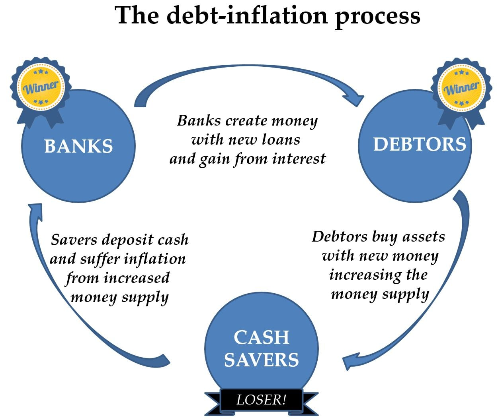
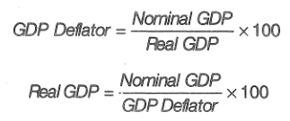
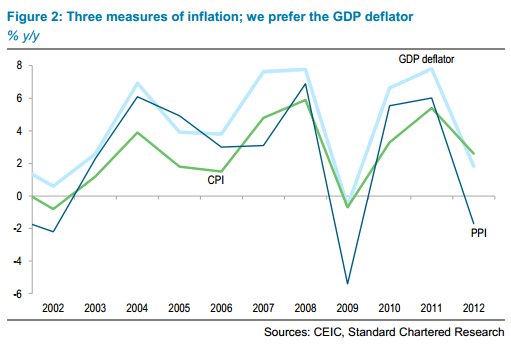
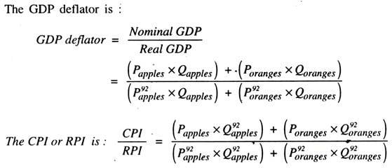

# What is Inflation

  -   General increase in prices, or more precise, the **purchasing
      power** of your money **decreases**

  -   Inflations isn't when only one particular product's price
      increases but when **all prices increases**

  -   In the late 1970s, Fed Chairman Paul Volcker made **taming
      inflation** his top priority

  -   By **increasing interest rates**, the Fed was able to tame
      inflation but, in the process, essentially created a **recession**

# Costs of Inflation

  -   Shoe-Leather Costs
    
      -   the **increased costs** of **transactions** due to inflation
    
      -   Since people **avoid holding** onto **money** during periods
          of inflation, people waste time and energy **marking
          transactions** to avoid sitting on cash.
    
      -   Banking sector increases

  -   Menu Costs
    
      -   real **costs** of **changing** listed **prices**
    
      -   In hyperinflation, countries will avoid changing prices.

  -   Unit-of-Account Costs
    
      -   Money becomes a less reliable unit of measurement
    
      -   "Profit" due to inflation is still taxed and therefore
          investment is discouraged
    
      -   This role of the dollar as a basis for contracts and
          calculation is called the unit-of-

  accountrole of money.

# Winners & Losers from Inflation

  -   Nominal interest rate
    
      -   the **actual interest** that is paid on a loan

  -   Real interest rate
    
      -   **Nominal interest** rate **- Expected inflation** rate

  -   Nominal vs. Real
    
      -   The **nominal** interest rate is the rate **actually** paid.
    
      -   The **real** interest rate is actual return the lender
          receives **net of inflation**

  -   **Borrowers win** with inflation because they pay back in nominal
      dollars.

  -   **Savers** and **lenders lose** because the amount of money they
      receive is **worth less**.

  -   Countries with **uncertain** levels of inflation generally **won't
      issue long-term**
  loans

  

# Wage-Price Spiral

  -   Combination of **"cost-push"** and **"demand-pull"** inflation
      leads to a wage-price spiral

  -   When there is **too much money** chasing too few goods, the price
      of products will tend to increase which leads to **"demand-pull"**
      inflation

  -   When workers demand **higher wages** as a result of inflated
      prices, prices of products consequently go up as well, leading to
      this "**wage-price**" spiral

  -   **Increased price of products leads to higher wages leads to
      increased price of products and so on**

  -   Keynesians tend to favor this model of how inflation works and
      that they prices are sticky downward or downward inflexible

  

# Monetarist View of Inflation

  -   Milton Friedman viewed inflation as simply an issue of **money
      supply**

  -   The quantity theory of money is quite simple: an **increase** in
      the **supply** of money will correspondingly **increase
      inflation**

  -   The Austrian view argues that using the **Consumer Price Index**
      (or CPI) to measure inflation is **inaccurate** because inflation
      in **unevenly spread** through different goods and services

  -   Paul Krugman, a Nobel Prize winning, "Keynesian" economist,
      rejects this Austrian view of inflation stating that the
      **monetary base tripled** in 2011 and yet there was **no
      widespread inflation**

# Measurement and Calculation of Inflation

  -   Aggregate Price Level
    
      -   measure of the **overall prices** in the economy

  -   Market Basket
    
      -   hypothetical set of **consumer purchases** of goods and
          services

  -   Price Index
    
      -   measures the **cost of purchasing** a given market basket in a
          given year
    
      -   (index value is set to 100 in the base year)

  
  
  

# CPI, PPI & GDP Deflator

  -   Consumer Price Index (CPI)
    
      -   **most commonly** used measure of inflation, market basket of
          a typical urban American family
    
      -   The Bureau of Labor Statistics sends employees out to **survey
          prices** on a **multitude** of **items** in food, apparel,
          recreation, medical care, transportation and other categories
    
      -   CPI tends to **overstate** inflation (**substitution bias**
          and **technological advances**)

  -   Producer Price Index (PPI)
    
      -   measures the cost of typical basket of goods and services that
          **producers purchase**
    
      -   Tends to be used as the "**early warning signal**" of changes
          in the inflation rate

  -   GDP
  Deflator

  

  -   Not exactly a price index but serves to show how much the
      **aggregate price level** has **increased**

  -   Unlike the CPI, GDP is **not** based on a **fixed basket** of
      goods and services.

  -   It's allowed to change with people's **consumption** and
      **investment patterns**

  -   The default "basket" in each year is the set of **all goods** that
      were produced in the country in that particular year.

  -   CPI, PPI, and GDP Deflator tend to move, generally, in the **same
      direction
  **

  

  -   Comparison
    
      -   equation

  

  -   prices of capital good
    
      -   included in GPD deflator (if produced domestically)
    
      -   excluded from CPI

  -   prices of imported consumer goods
    
      -   included in CPI
    
      -   excluded from GDP deflator

  -   the basket of goods
    
      -   CPI: fixed
    
      -   GDP Deflator: changes every year