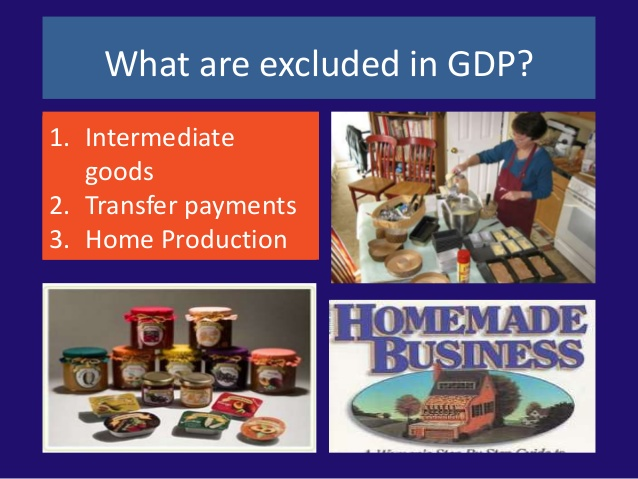

# Question 3

  
  
  
  
  

# Question 18

  

# Question 19

  -   Classical economists vs. Keynesian economists

  
  
  
  
  ![Keynes Must pull economy out of bust (short term focus) People have
  chaotic 'animal spirit' The economy can be steered A 'circular flow of
  income' exists Economic regulation is good Bail-outs good The short
  run is most important Pro-Government Govenrment acts in best interest
  of public Savings should be spent now Kept bad businesses afloat to
  protect jobs Economy can settle at sub-optimal level without help
  Respect for human suffering and job protection Hayek Must avoid
  boom-bust cycles (long term focus) People are rational The economy
  must consist of free market forces Markets are not easily predictable
  Economic regulation is bad Bail-outs bad The long run is most
  important Anti-Government (causes malinvestment) People act in their
  own best interest Savings should be hoarded for future (classical
  view) Liquidation of bad businesses necessary Economy will settle at
  optimal level unhindered Respect for entrepreneurship and economic
  stability ](./media/image171.png)

# Question 22

  ![Appreciation/Depreciation N \[14-191 14. If the dollar depreciates
  relative to the peso, the peso will (appreciate/depreciate) relative
  to the dollar. 15. Appreciation of the dollar will tend to
  (increase/decrease) American imports & (increase/decrease) American
  exports 16. The yen price of the dollar has decreased from AM X
  Y150=$I to YIOO=$I, which means the dolla (apprec/gugs), which
  (incr/decr) our imports from Japan 17. Depreciation of the euro will
  (increase/decrease) European exports & (increase/decrease) their
  imports. 18. If Mexico decides to increase their investments in the
  U.S., the peso Will (appreciate/depreciate) whi would
  (increase/decrease) \[Mexico's imports U.S. exports to Mexico. 19. If
  the exchange rate changes so that more Japanes yen are required to buy
  a dollar then the yen will (appreciate/depreciate) and Americans will
  purchase (more/less) Japanese goods. Rat" Rate 1 of Dollars Y 120 Y
  100 \# Of Dollars ](./media/image172.png)

# Question 26

  -   Stagflation is often caused by a **SUPPLY** side shock.

  

# Question 32

  
  
  

# Question 36

  
  
  
  
  

# Question 42

  -   Current account deficit = Capital account surplus

  -   Capital account surplus = Current account deficit

# Question 44

  ![(46%) 48. Assume that the government implements a deficit-reduction
  policy that results in changes in aggregate income and output. Then
  the Fed engages in monetary policy actions that reverse the changes in
  income and output caused by fiscal policy action. Which of the
  following sets of changes in taxes, government spending, the RR, and
  the discount rate is most consistent with these policies? Taxes a.
  Increase b. Increase Government Spending Increase Decrease Required
  Reserve Ratio Discount Rate Decrease Decrease Increase No chanqe The G
  would increase T and decr G to reduce the deficit which would reduce
  AD. To reverse this & incr AD, the Fed would decr the RR & NC the DR
  to lower the I.R. \[decreasing the Discount Rate would have been
  better but is not a choice here\] ](./media/image179.png)

# Question 46

  

# Question 47

  ![47. Which of the following best explains why transfer payments are
  not included in the calculation Of gross domestic product? (A)
  Transfer payments are used to pay for inter- mediate goods, and
  intermediate goods are excluded from gross domestic product. (B)
  Transfer payments are a government expenditure, and government
  expenditures are excluded from domestic uct. (C) Recipients of
  transfer payments have not produced or supplied goods and services in
  exchange for these payments. men o trans er paymen are usu y children,
  and income earned by children is excluded in gross domestic product.
  (E) Recipients of transfer payments are some- times not citizens of
  the United States. ](./media/image181.png)
  
  
  
  
  
  
  
  
  
  

# Question 51

  

# Question 52

  
  
  
  
  