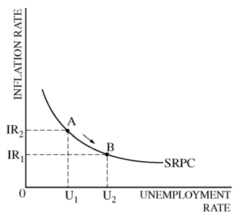
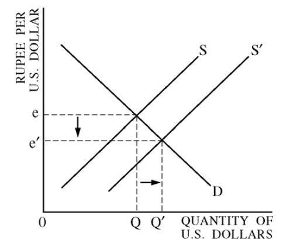

# Question 1 (a)

  -   The effect of the decrease in consumption spending

  

# Question 1 (e)

  -   As a result of the **increase** in **interest rate**, the **growth
      rate** will **fall**.

  -   The **investment spending decreases** and, as a result, **capital
      formation** will **decrease**.

# Question 2 (a)

  -   Current account record:
    
      -   A United States resident buys chocolate from Belgium
    
      -   A United States manufacturer buys computer equipment from
          Japan.

# Question 2 (b)

  -   Increase in income causes imports to increase, therefore the
      current account balance will decrease or move toward a deficit.

# Question 2 (c)

  -   The effect of an increase in United States firm's direct
      investment in India
    
      -   X-axis: Quantity of US Dollars
    
      -   Y-axis: Rupee per US Dollar

  
  
  ![The Demand and Supply Line-ups in Foreign Exchange Markets Demand
  for the U.S. Dollar Comes from... A U.S. exporting firm that earned
  foreign currency and is trying to pay U.S. -based expenses Foreign
  tourists visiting the United States Foreign investors who wish to make
  direct investments in the U.S. economy Foreign investors who wish to
  make portfolio investments in the U.S. economy Supply of the U.S.
  Dollar Comes from... A foreign firm that has sold imported goods in
  the United States, earned U.S. dollars, and is trying to pay expenses
  incurred in its home country U.S. tourists leaving to visit other
  countries U.S. investors who want to make foreign direct investments
  in other countries U.S. investors who want to make portfolio
  investments in other countries ](./media/image193.png)
  
  ![When the U.S. government imposes a quota on the import of Japanese
  cars, nothing happens in the market for loanable funds in panel (a) or
  to net capital outflow in panel (b). The only effect is a rise in net
  exports (exports minus imports) for any given real exchange rate. As a
  result, the demand for dollars in the market for foreign-currency
  exchange rises, as shown by the shift from DI to in panel (c). This
  increase in the demand for dollars causes the value of the dollar to
  appreciate from El to E2. This appreciation of the dollar tends to
  reduce net exports, offsetting the direct effect of the import quota
  on the trade balance. FIGURE 6 The Effects of an Import Quota Real
  Interest Rate r, (a) The Market for Loanable Funds Supply Quantity of
  Loanable Funds causes the real exchange rate to appreciate. (b) Net
  Capital Outflow Real Interest Rate 3. Net exports, however, remain the
  sa Real Exchange Rate Net Capital Outflow Supply n. An Import quota
  increases the demand for ollars D, Quantity of Dollars (c) The Market
  for Foreign-currency Exchange ](./media/image194.png)