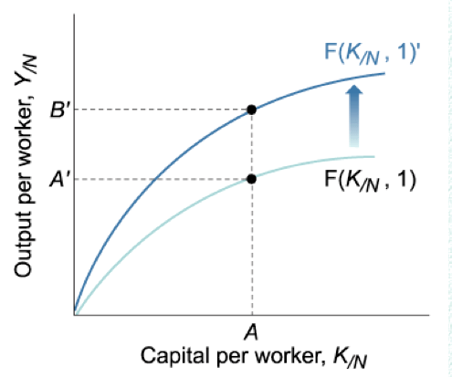

<a href="./exams/Released Exam 2012.pdf"  target="_blank" >Released Exam 2012</a>

# Question 9

  -   The official unemployment rate understates the unemployment level
      in the economy because the official unemployment rate ignores
      underemployed and discouraged workers

# Question 12

  

# Question 28

  -   Technology in output per worker

  

# Question 30

  
  
  

# Question 32

  

# Question 33

  

# Question 34

  -   Unanticipated inflation increases the economic well-being of net
      debtors

# Question 35

  -   Inflationary expectations --\> inflation --\> unemployment

  

# Question 37

  -   Wage-Price Spiral: Combination of **"cost-push"** and
      **"demand-pull"** inflation leads to a wage-price spiral

  -   When there is **too much money** chasing too few goods, the price
      of products will tend to increase which leads to **"demand-pull"**
      inflation

  -   When workers demand **higher wages** as a result of inflated
      prices, prices of products consequently go up as well, leading to
      this "**wage-price**" spiral

  -   **Increased price of products leads to higher wages leads to
      increased price of products and so on**

  -   Keynesians tend to favor this model of how inflation works and
      that they prices are sticky downward or downward inflexible

  

# Question 38

  
  
  

# Question 40

  
  
  

# Question 49

  

# Question 50

  ![Exhibit 5: Production (and Consumption) Possibilities Frontiers with
  Trade (a} United States U.S. preferred combination 400 300 200 100 0
  100 200 300 400 Clothing 400 300 200 100 (b) \[zodia Izodian preferred
  combination 1 0 100 200300400 Clothing + The U.S. consumption
  possibilities frontier stops at 400 million units Of clothing because
  that is the most that Izodians can produce \*With production and
  specialization, the U.S. produces 600 units Of food, consumes 400
  units, and exchanges the rest for 200 million units of Izodian
  clothing. \*Izodians produce 400 units of clothing, wear 200 million
  units, and exchange the rest for 200 million units of U.S. food
  ](./media/image234.png)

# Question 54

  -   An increase in the labor force would LEAST likely increase labor
      productivity.

# Question 59

  -   Advocates of a monetary rule recommend increasing the money supply
      at a rate that is equal to the rate of increase in long-run real
      GDP

# Question 60

  -   Most economists believe that in the **long-run**, there is **no
      trade-off** between unemployment and inflation

  -   To **avoid accelerating inflation** overtime, the **unemployment**
      rate must be **high enough** that the **actual rate** of inflation
      **matches** the **expected rate** of inflation

  -   The **unemployment rate** at which inflation does **not change**
      over time is known as the **nonaccelerating inflation rate of
      unemployment**, or **NAIRU**

  -   The Long-Run Phillips Curve (**LRPC**) is the relationship between
      **unemployment** and **inflation after expectations** of
      unemployment have had **time to adjust** over time