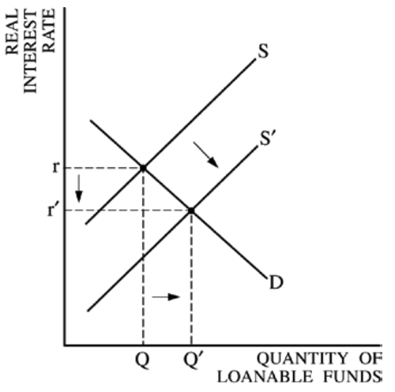
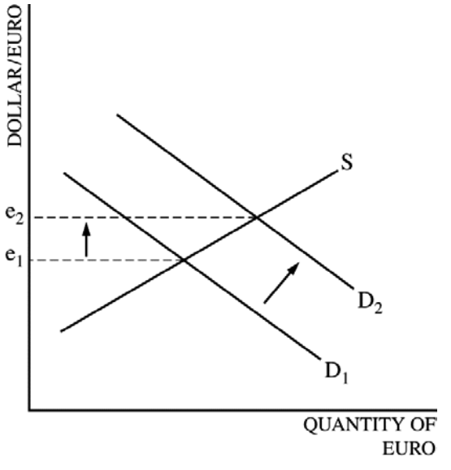
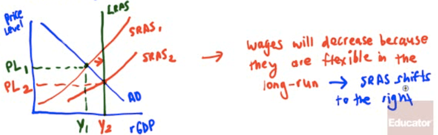

<a href="./exams/Free Response 2013.pdf"  target="_blank" >Free Response 2013</a>

<a href="./exams/Scoring Guidelines 2013.pdf"  target="_blank" >Scoring Guidelines 2013</a>

# Question 1 (b)

  -   Graph of the money market vs Graph of the loanable funds market

  

  -   Graph of the loanable funds market

  -   x-axis: Quantity of Loanable Funds

  -   y-axis: Real Interest Rate

  

# Question 1 (c)

  -   More investment, higher GDP growth rate

  

# Question 1 (d)

  -   Foreign exchange market for the euro

  -   x-axis: Quantity of Euro

  -   y-axis: Dollar per Euro

  -   Label e on the y-axis as exchange rate

  

  -   The demand for the euro increases because the higher real interest
      rate in the euro zone leads to higher returns for financial
      **investments** in the euro zone, **attracting funds** from the
      United States to the euro zone.

# Question 1 (e)

  -   Current Account
    
      -   Depreciate = Deficit
    
      -   Appreciate = Surplus

  
  
  ![Table 12015 balance of payments (billions of dollars) Current
  account Gross exports (goods and services) Gross imports (goods and
  services) Net income New current transfers Current account balance
  Capital and financial account Capital account Financial account,
  excluding net reserve assets Financial account, reserve assets
  Financial account Capital and financial account balance Net errors and
  omissions Balance of payments (current account + capital and financial
  account + net errors and omissions) Sources: Wind, SAFE $2, 375 $2,007
  -$9 -$16 So $343 -$161 $293 -$161 -$132 So ](./media/image252.png)
  
  ![Political Stability and Economic Performance Inflation Differentials
  Interest Rate Differentials Current Account Balances Public Debt
  Balances Investors inevitably seek out stable countries with strong
  economic performance to invest capital Countries with lower inflation
  tend to have stronger currencies as purchasing power increases
  relative to other currencies Higher interest rates attract foreign
  capital and therefore cause currencies to appreciate Countries with
  current account deficits tend to have weaker currencies Countries with
  large public debts are less attractive to foreign investors, large
  debt encourages inflation ](./media/image253.png)

# Question 2 (e)

  

  -   SRAS will increase because wages and some other production costs
      decrease during a recession

  
  
  

# Question 3 (a)

  -   x-axis: Unemployment rate

  -   y-axis: Inflation rate

  

# Question 3 (e)

  -   Real Interest Rate = Nominal Interest Rate - **EXPECTED**
      Inflation Rate