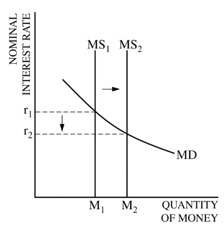
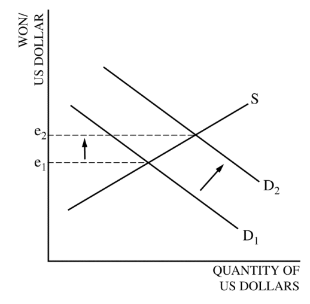

<a href="./exams/Free Response 2014.pdf"  target="_blank" >Free Response 2014</a>

<a href="./exams/Scoring Guidelines 2014.pdf"  target="_blank" >Scoring Guidelines 2014</a>

# Question 1 (b)

  -   **Increase** in government **spending** will **reduce** the
      **Cyclical** Unemployment and have **no effect** on the **Natural
      Rate** of Unemployment

  -   Cyclical Unemployment

  ![Cyclical Unemployment • • eve When the economy goes into a recession
  and tota output falls, the unemployment rate rises Since it arises
  from conditions in the overall economy, cyclical unemployment is a
  problem for macroeconomic policy It is caused by the business cycle
  hence called 'cyclical' Macroeconomists say we have reached full
  employment when cyclical unemployment is reduced to zero But the
  overall unemployment rate at full employment is greater than zero
  Because there are still positive levels of frictional, seasonal, and
  structural unemployment ](./media/image257.png)

  -   Natural rate of unemployment

  ![RELATIONSHIPS BETWEEN THE TYPES OF UNEMPLOYMENT NATURAL UNEMPLOYMENT
  = FRICTIONAL UNEMPLOYMENT + STRUCTURAL UNEMPLOYMENT ACTUAL
  UNEMPLOYMENT CYCLICAL UNEMPLOYMENT NATURAL UNEMPLOYMENT + The NRU is
  also called the full employment rate of unemployment. Full employment
  does not mean zero unemployment. It is reached when labor rnarkets are
  in balance; the number of job seekers equals the number of job
  vacancies. At this point the economy's potential output is being
  achieved. The natural rate of unemployment is not fixed; it changes
  over time and is affected by economic policies.
  ](./media/image258.png)

# Question 1 (d)

  -   The effect of increase in government spending on the real interest
      rate
    
      -   **Upward-sloping Supply**
    
      -   Downward-sloping Demand
    
      -   Increase in Demand ≈ Decrease in Supply

  

# Question 1 (e)

  -   The economic growth rate will fall with higher interest rate,
      because it will **slow down capital formation**

# Question 2 (a)

  -   Buy bonds --\> Shift demand of bonds to the right --\> Increase
      the price of bonds

  

# Question 2 (b)

  -   Label MS and MD instead of S and D for graph of the money market

  -   **NOMINAL** interest rate at the y-axis

  

# Question 2 (d)

  -   Discount rate
    
      -   The interest rate that the Federal Reserve charges banks for
          borrowing from its discount window

  
  
  

# Question 3 (a)

  -   If inflation does fall then there will be other benefits from
      having a low inflation rate such as:
    
      -   More competitive exports (UK goods rise less than other
          countries)
    
      -   More certainty and less confusion encouraging investment
    
      -   Lower menu costs (though quite insignificant at the moment)

# Question 3 (b)

  -   Import \> Export --\> Current Account Deficit

  -   Import < Export --\> Current Account Surplus

  

  -   Y=C+I+G+NX
    
      -   Higher US exports increased AD
    
      -   Production increases to meet the increased export demand from
          other countries

# Question 3 (c)

  -   Lower inflation rate for US dollar --\> Higher demand for US
      dollar

  