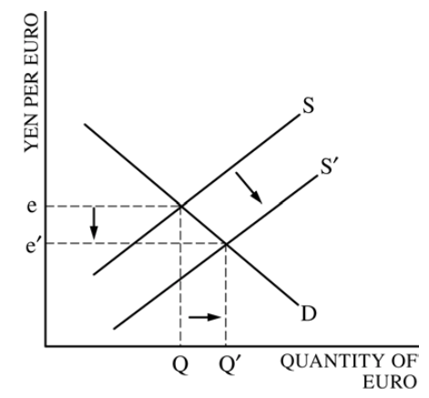

# Question 1 (d)

  -   Spending Multiplier
    
      -   **Minimum required change in government spending = Value of
          recessionary gap / Spending Multiplier **

  

  -   The minimum required change in taxes will be greater than the
      minimum required change in government spending.

  -   The **tax multiplier** (mpc/mps = 0.8/0.2 = 4) is **smaller** than
      the government **spending multiplier** (1/mps = 1/0.2 = 5) because
      part of the initial increase in disposable income caused by the
      decrease in income tax will be saved rather than spent.

# Question 1 (e)

  -   Lower income tax rate --\> More **disposable income** --\> More
      **consumption** and **investment** --\> Increase in Aggregate
      Demand

# Question 3 (a)

  -   Foreign exchange market for the euro

  

  -   The supply of Euro in the foreign exchange market will increase
      because when real interest rates in Japan increased, people with
      euros will want to **invest in Japan's financial assets** because
      they will see a **high return**.

  -   To purchase Japan's financial assets, they will demand yen from
      the foreign exchange market, leaving behind euro.