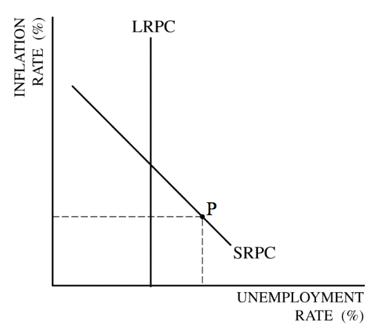

<a href="./exams/Free Response 2016.pdf"  target="_blank" >Free Response 2016</a>

<a href="./exams/Scoring Guidelines 2016.pdf"  target="_blank" >Scoring Guidelines 2016</a> 

# Question 1 (a)

  -   Phillips Curve
    
      -   x-axis: unemployment rate
    
      -   y-axis: inflation rate (Since i**nflation rate could be
          negative**)
    
      -   LRPC = NAIRU = Non-Accelerating Inflation Rate of Unemployment

  

# Question 1 (d)

  -   Open Market Operation and Federal Funds Rate
    
      -   To **Bloat** the economy --\> **Buy** bonds --\> Increase in
          Money Supply --\> Increase reserve --\> **Decrease** Federal
          Funds Rate
    
      -   To **Shrink** the economy --\> **Sell** bonds --\> Decrease in
          Money Supply --\> Decrease reserve --\> **Increase** Federal
          Funds Rate

  

# Question 1 (e)

  -   The effect of expansionary monetary policy on GDP

  ![Figure 15.7 Monetary policy (1 of 2) The Fed conducts expansionary
  monetary policy when it takes actions to decrease interest rates to
  increase real GDP. This works because decreases in interest rates
  raise consumption, investment, and net exports. The Fed would take
  this action when short-run equilibrium real GDP was below potential
  real GDP. The increase in aggregate demand encourages increased
  employment, one of the Fed's primary goals. Copyright @ 2017 Pearson
  Education, Inc \_ All Rights Reserved Long•run causes SHAS A 02 Real
  GOP Expmi—y PEARSON ](./media/image270.png)
  
  

# Question 1 (g)

  -   The effect of change in interest rate on foreign exchange market

  

# Question 2 (c)

  ![Review • Dollar value of Required Reserves = Amount of deposit X
  required reserve ratio • Excess Reserves = Total Reserves — Required
  Reserves • Maximum amount a single bank can loan = the change in
  excess reserves caused by a deposit • The money multiplier =
  l/required reserve ratio • Total Change in Loans = amount single bank
  can lend X money multiplier • Total Change in the money supply = Total
  Change in Loans + $ amount of Fed action • Total Change in demand
  deposits = Total Change in Loans + any cash deposited
  ](./media/image273.png)

  -   If Mr. Smith deposits $100 in the bank and $10 is kept in reserves
      then $90 can be loaned out.

  -   If that $90 is deposited in another bank then 10% of the $90 or $9
      must be kept in reserve and therefore $81 can then be loaned out
      in the next round and 10% of that must be kept in reserve and so
      on and so on and so on. Until all is loaned out.

# Question 2 (d)

  -   The **original** $100 was already part of the money supply so you
      **can't include** that in the calculation.