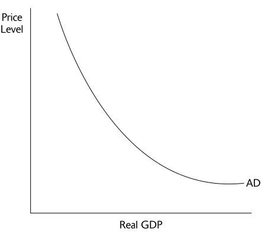

# What is Aggregate Demand

  -   The aggregate demand curve shows the relationship between the
      **aggregate price level** and the **quantity of aggregate output**
      demanded by households, business, the government and the rest of
      the world

  -   **Aggregate output** and **real GDP** can be used interchangeably

  -   All things equal, a movement **down** the AD curve leads to a
      **lower aggregate price** level and **higher aggregate output**,
      and vice versa

  -   Recall the basic equation of national income accounting
    
      -   **Y = C + I + G + NX**

  

# Why is the AD Downward Sloping?

  -   Demand Curve vs. Aggregate Demand Curve
    
      -   If the demand for one product is downward sloping, wouldn’t
          the aggregate demand also do the same?
    
      -   The **demand curve** for an individual good assumes that you
          **hold price of other goods constant**
    
      -   For the **aggregate demand**, there is a **simultaneous
          change** in the price of **all final goods** and
          **services**\!
    
      -   If the price of gas goes up, and people buy more econ
          textbooks, it **doesn't necessarily change** anything at all.
    
      -   So then, why does a rise in the aggregate price level lead to
          a fell in the quantity of all domestically produced final
          goods and services produces?

  -   Wealth Effect
    
      -   change in **consumer spending** caused by the altered
          **purchasing power** of consumer's assets
    
      -   An **increase** in the **aggregate price level** means people
          are relatively **poorer**, and vice versa
    
      -   Thus, consumer spending or C, changes and you move up and down
          the AD curve

  -   Interest Rate Effect
    
      -   change in **investment** and **consumer spending** caused by
          **interest rates** that result from changes in **demand for
          money **
    
      -   With a **higher aggregate price level**, causes an
          **increase** in **money** holdings which **reduces funds**
          available for **borrowing**
    
      -   **Interest rate increase** and consumer spending, **C**, and
          investment spending, **I decreases**

# Shift in the Aggregate Demand Curve

  

  -   Changes in Expectations
    
      -   Consumers base spending on **future income**
    
      -   If the Conference Board, or Michigan Consumer Sentiment Index
          reports an **increase** in **consumer confidence**, **AD** has
          **increased **

  -   Changes in Wealth
    
      -   People with **more wealth** will tend to **spend more**
    
      -   If the stock market **crashes** or real estate **values
          plummet**, the **AD** shifts to the **left**

  -   Size of the Existing Stock of Physical Capital
    
      -   If the **inventory** of housing is **high**, the **AD** will
          shift **left**
    
      -   If **inventory** is **low**, then **AD** will shift to the
          **right**

  -   Fiscal Policy (use of **taxes** and **government spending**)
    
      -   Expansionary fiscal policy
        
          -   **Increase** in **Government spending** or **decrease** in
              **taxes** will shift **AD** to the **right**
    
      -   Contractionary fiscal policy
        
          -   **Decrease** in **Government spending** or **increase** in
              taxes will shift **AD** to the **left**

  -   Monetary Policy (central bank's or Fed's use of changes in
      **quantity of money** or **interest rates**)
    
      -   Expansionary monetary policy
        
          -   If the Fed **increase** the **money supply** (**lowered
              interest rates**), then **AD increases**
    
      -   Contractionary monetary policy
        
          -   If the Fed **decrease** the **money supply** (**higher
              interest rates**), then **AD decreases**

![Factors That Shift the Aggregate Demand Curve Changes in expectations
If consumers and firms become more optimistic, . If consumers and firms
become more pessimistic, Changes in wealth If the real value of
household assets rises, . If the real value of household assets falls, .
Size of the existing stock of physical capital If the existing stock of
physical capital is relatively small, . If the existing stock of
physical capital is relatively large, Fiscal policy If the government
increases spending or cuts taxes, . If the government reduces spending
or raises taxes, . Monetary policy If the central bank increases the
quantity of money, . If the central bank reduces the quantity of money,
.. aggregate demand increases. aggregate demand decreases. aggregate
demand increases. aggregate demand decreases. aggregate demand
increases. ... aggregate demand decreases. aggregate demand increases.
aggregate demand decreases. aggregate demand increases. ... aggregate
demand decreases. ](./media/image22.png)