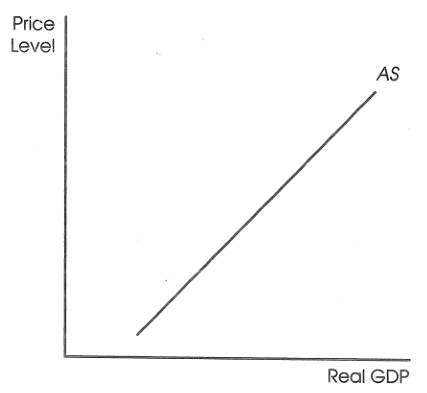
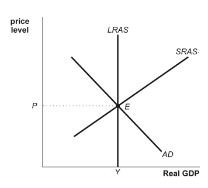
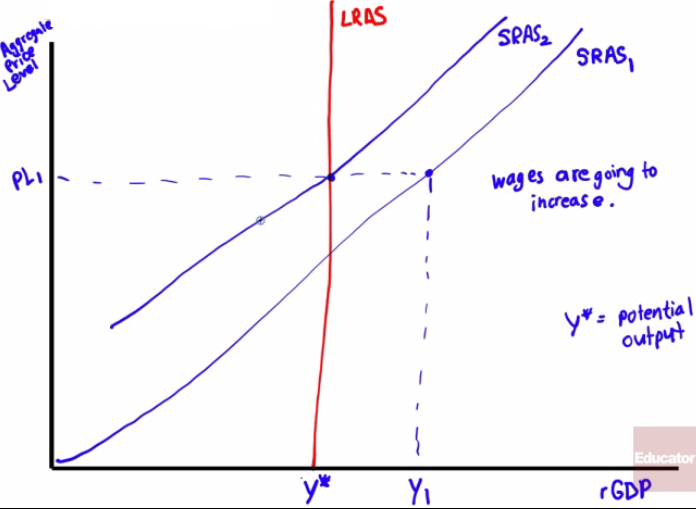
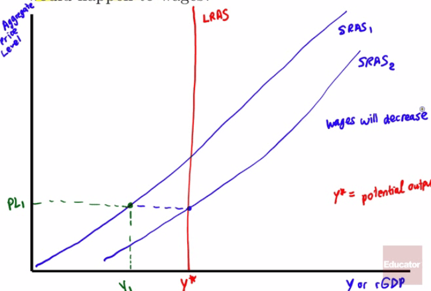

# What is Short-Run Aggregate Supply?

  -   Shows the relationship between the **aggregate price level** and
      the quantity of **aggregate output supplied** in the economy

  -   As the **aggregate price level increases**, the **aggregate output
      increases**

  -   **Profit per unit of output = Price per unit of output -
      Production cost per unit of output**

  -   As the **price level increases**, producers are collectively going
      to **produce more** goods and services

  -   This is all in the
  **short-run**

  

# Nominal Wages and Sticky Wages

  -   The largest source of **inflexible production cost** is **wages**
      paid to workers (all forms of compensation)

  -   Typically, **wages** paid to workers are paid as **nominal wages**
      and **not real wages**
    
      -   We think in nominal terms, not in real terms
    
      -   Wages are **not** necessarily **responsive** to **current
          economic conditions**
    
      -   Wages, therefore, are considered **sticky**

  -   Sticky wages are nominal wages that are **slow to fall** in
      **unemployment** and **slow to rise** in labor **shortages**

# Shifts in the Aggregate Supply Curve

  

  -   Changes in Commodity Prices
    
      -   **Increase** in the price of **oil raises production costs**
          and shifts **AS** to the **left**
    
      -   **Decrease** in the price of **oil lowers production costs**
          and shifts **AS** to the **right**

  -   Changes in Nominal Wages
    
      -   A **fall** in nominal **wages** shifts the **AS** to the
          **right**
    
      -   An **increase** in **money** paid to **workers** (cost of
          living increases) shifts the **AS** to the **left**

  -   Changes in Productivity
    
      -   **Technology** improvements will cause workers to **increase
          productivity**. **AS** shifts **right**
    
      -   New worker **regulations** has the opposite effect. **AS**
          shifts to the **left **

  ![Factors that Shift the Short-Run Aggregate Supply Curve Changes in
  commodity prices If commodity prices fall, If commodity prices rise,
  Changes in nominal wages If nominal wages fall, If nominal wages rise,
  . Changes in productivity If workers become more productive, . If
  workers become less productive, . ... short-run aggregate supply
  increases. ... short-run aggregate supply decreases. ... short-run
  aggregate supply increases. ... short-run aggregate supply decreases.
  ... short-run aggregate supply increases. ... short-run aggregate
  supply decreases.
  ](./media/image25.png)

# Long-Run Aggregate Supply Curve

  

  -   Shows the relationship between the **aggregate price level** and
      the **quantity** of **aggregate output supplied** that would exist
      if all prices, including nominal wages were **fully flexible**

  -   Potential output
    
      -   level of **real GDP** the economy would produce if all prices,
          including nominal wages **adjusted properly**

  -   What would shift the LRAS?
    
      -   Increases in **resources** (land, labor, capital)
    
      -   Increases in the **quality** of **resources** (more educated
          workforce)
    
      -   **Technological** progress

# Examples 

  -   If the aggregate output exceeded potential output, what would
      happen to the SRAS? What would happen to wages?

  

  -   If the aggregate output fell short of potential output, what would
      happen to the SRAS? What would happen to wages

  