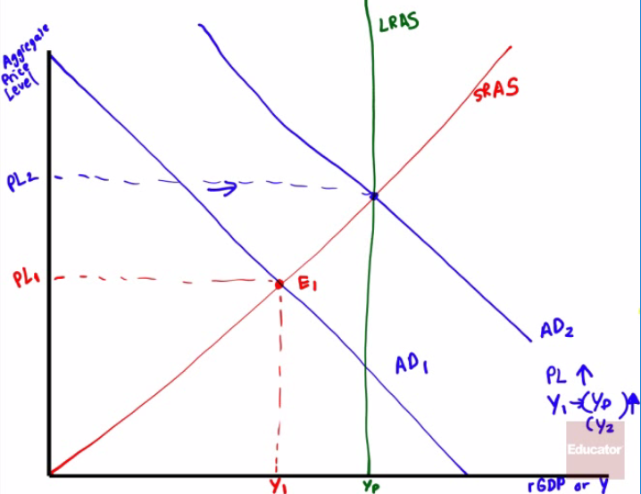
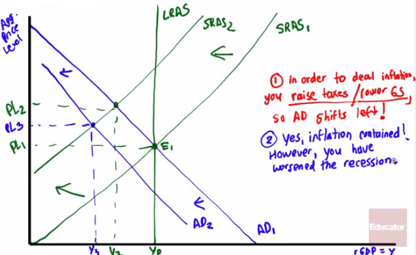

# The AD-AS Model

  

  -   **Short-run macroeconomic equilibrium** occurs when the quantity
      of aggregate output supplied equals the quantity demand (**AD =
      SRAS**)

  -   **Long-run macroeconomic equilibrium** occurs when the point of
      short-run macroeconomic equilibrium is on the long-run aggregate
      supply curve (**AD = SRAS = LRAS**)

  -   At the **LRAS**, the economy is functioning at the **Potential
      Output**, or Yp

  -   If the **aggregate output in the short-term** is **below** the
      potential output, the economy faces a **recessionary** gap

  -   If the **aggregate output in the short-term** is **above** the
      potential output, the economy faces an **inflationary** gap

# The Long-Run Approach

  -   In a **recessionary gap**, the following occurs
    
      -   An initial **negative demand shock** (**stock market
          crashes**)
    
      -   **AD** shifts to the **left**, and so the aggregate price
          level and aggregate output reduce, which leads to **higher
          unemployment** in the short-run
    
      -   Eventually, a fall in nominal wages in the long run
          **increases** the **SRAS** and moves the economy **back to
          potential output**

  

  -   Expansionary Fiscal Policy
    
      -   "In the long-run, we are all dead." John Maynard Keynes.
    
      -   Use expansionary fiscal policy to **boost aggregate demand**
          in order to get the economy **back** to its **potential
          output**
        
          -   Increase government spending (direct approach)
        
          -   Decrease taxes
        
          -   Increase in government transfers
    
      -   Graph

  

  -   In a **inflationary** gap, the following occurs
    
      -   An initial **positive demand shock** (**real estate market
          booms**)
    
      -   **AD** shifts to the **right**, and so the aggregate price
          level and aggregate output increase, which leads to **higher
          inflation** in the short-run and **reduces unemployment**
    
      -   Eventually, an **increase** in nominal **wages** in the long
          run **decreases** the **SRAS** and **moves** the economy
          **back to potential output**

  

  -   Contractionary Fiscal Policy
    
      -   In 1968, President Lyndon Johnson imposed a temporary 10% hike
          on income taxes to stop inflation
    
      -   Use **contractionary** fiscal policy to **decrease aggregate
          demand** in order to get the economy **back to** its
          **potential output**
        
          -   Decrease government spending (direct impact)
        
          -   Increase taxes
        
          -   Decrease in government transfers
    
      -   Graph

  

# Stabilization Policy

  -   Use of government policy to **reduce** the **severity** of
      recessions and **rein** in excessively strong **expansions**

  -   Should the government use **fiscal** (or **monetary**) **policy**
      in order to **reduce** the **severity** of negative demand shocks?

  -   What should the government do in the face of a negative supply
      shock (or stagflation)
    
      -   If you **boost** AD, you make **inflation worse**
    
      -   If you **decrease** AD, you create **more unemployment**

  -   Examples
    
      -   Assume the price of oil increases and the government attempts
          to combat this by **lowering taxes** and **increasing
          government spending**. What happens?

  

  -   Assume the price of oil increases and the government attempts to
      combat this by **raising taxes** and **reducing government
      spending**. What happens?

  