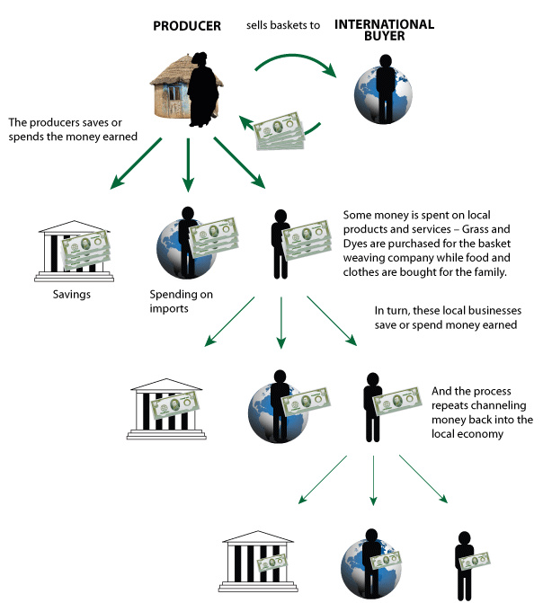
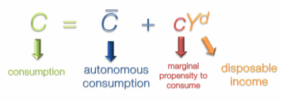
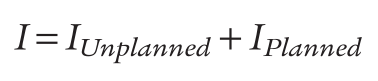
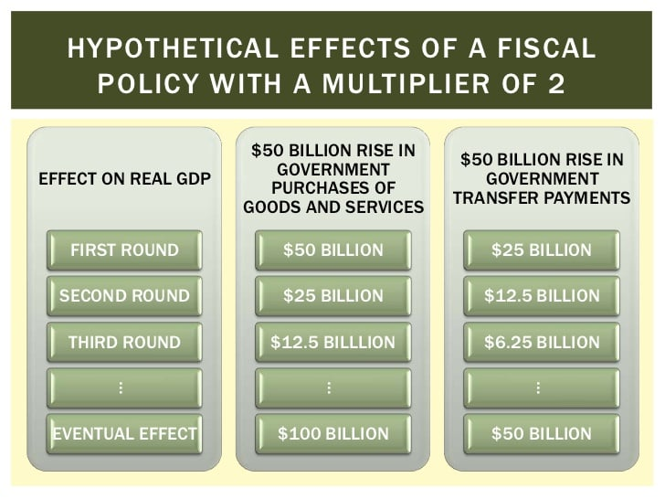

# The MPC and MPS

  -   Intro
    
      -   When **investment spending increases**, there will be an
          **increase** in the **income** and the value of **aggregate
          output** by the same amount
    
      -   An increase in aggregate output leads to an **increase** in
          **disposable income** and to more consumer spending, which
          leads to **increased output**
    
      -   How large is the total effect on aggregate output if we **sum
          up all** the rounds of spending increases
    
      -   It depends on what economists called the **marginal propensity
          to consume** (MPC) or the **marginal propensity to save**
          (MPS)
    
      -   
    
      -   
    
      -   MPC + MPS = 1

  -   The marginal Propensity to Consume
    
      -   The MPC is a number between 0 and 1
    
      -   If consumers **save all** their money, the number would be
          **0**
    
      -   If consumers **spend all** their money, the number would be
          **1**
    
      -   Usually, the number is between 0 and 1 with **industrialized
          countries** having a **higher** number and **developing
          countries** with **lower** numbers
    
      -   If the MPC is 0.8, what's the impact on the total aggregate
          spending if there's an increase of 50 million in spending?
        
          -   Total Increase = Spending Multiplier \* Initial Increase =
              1/(1-0.8) \* 50 =
  250

# The Multiplier Effect

  

  -   **Autonomous** change in aggregate spending
    
      -   an **initial rise** or **fall** in aggregate spending that is
          the **cause**, not the result, **of** a **series of income**
          and **spending changes**

  -   Multiplier
    
      -   **ratio** of the **total change** in **real GDP** caused by an
          autonomous change in aggregate spending to the size of that
          **autonomous change**

  

  -   The size of the multiplier depends on the MPC
    
      -   The higher the MPC, the more disposable income get recycled
          back into consumer spending
    
      -   The lower the MPC, the more disposable income "leak out" into
          savings

# Consumption Function

  -   Consumption function is an **equation** showing how an individual
      household's **consumer spending changes** with **disposable
      income**

  -   **Autonomous consumer spending** would be the amount spent
      **regardless of income
      **

  -   

  -   

  -   Let's assume that a equals $20,000 and the MPC equals 0.6. What
      would the consumption be if the income is $100,000? $200,000?
    
      -   c = a + MPC \* yd = 20,000 + 0.6 \* 100,000 =
          80,000
    
      -   c = a + MPC \* yd = 20,000 + 0.6 \* 200,000 =
          140,000

  -   Graph

  

# Shift of the Aggregate Consumption Function

  
  
  

  -   Changes in Expected Future Disposable Income
    
      -   If you land a **higher-paying job**, you will tend to
          **consume more** money now **even** though your current
          **income** is the **same**
    
      -   Conversely, if you are worried about a job **layoff**, you
          will probably **decrease** your current **expense**.

  -   Changes in Aggregate Wealth
    
      -   A booming stock market will tend to **increase** an
          **individual's wealth**, and therefore, his **consumption**
    
      -   A fall in housing prices, conversely, will tend to
          **decrease** an **individual's net worth**, and therefore her
          **consumption**

# Investment Spending 

  -   **Planned investment spending** is the investment spending that
      businesses **intend** to undertake during a given time period

  -   If **interest rates** goes **up**, **less investment** spending
      occurs.

  -   If **interest rates** go **down**, there is **more investment**
      spending

  -   **High expected** future growth rate of GDP **increases
      investment**

  -   **Low expected** future growth rate **decreases investment**

  -   

  -   **Positive unplanned inventory investment** occurs when **sales**
      are **less** than business **expects**. **Excess sales** leads to
      **negative unplanned inventory investment**

  -   Rising **inventory** indicates **slowing economy **

# Tax (or Government Transfer) Multiplier

  -   **Changes in taxes** (or increase in **transfer payment**) shifts
      the aggregate demand curve by **less** than an equal-sized change
      in **government purchases**

  -   The presence of taxed **decrease** the
  **multiplier**

  

# Automatic Stabilizers

  -   **Government spending** and **taxation** rules that cause fiscal
      policy to be **automatically expansionary** when the economy
      **contracts** and **automatically contractionary** when the
      economy **expands**

  -   As the economy **expands**, the multiplier **reduces** because the
      increase in income is **siphoned off**

  -   As the economy **contracts**, the multiplier **increase** because
      the government is collecting **less** in **taxes** (a de facto
      expansionary policy in the face of a recession)

  