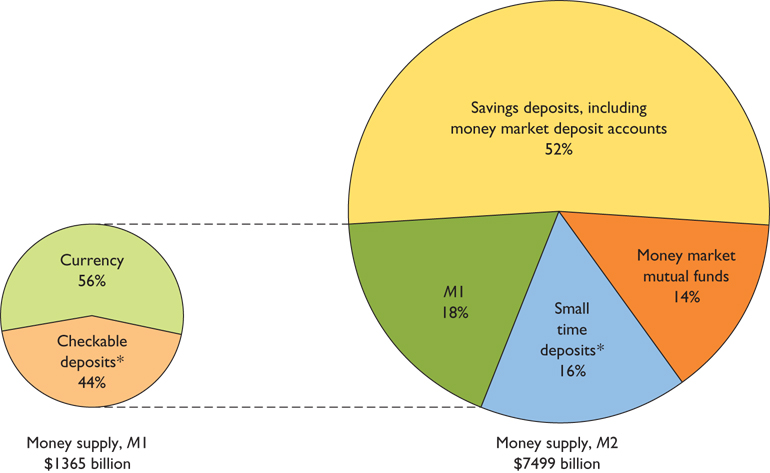
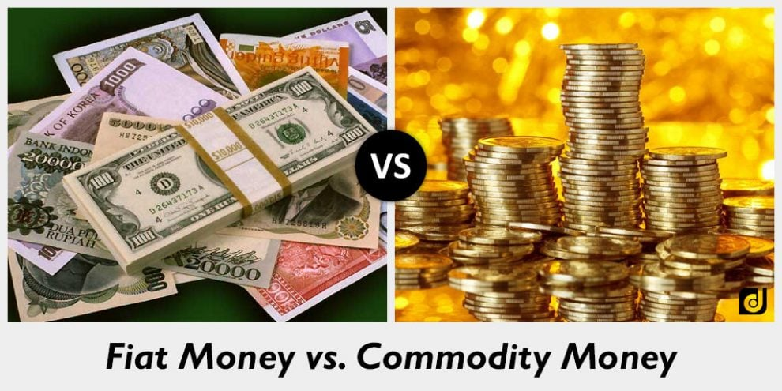

# What is Money?

  -   There are **two** types of Money (M1), or assets that can be
      easily used to **purchase goods** and **services**.
    
      -   **Currency** in circulation is all the money held by the
          population
    
      -   **Checkable bank deposits** are all the funds held in bank
          accounts in which individuals can write checks off of
    
      -   Traveler's checks

  -   Another type of money that is "almost" checkable would be
      **money** in **saving accounts**, CDs or money market accounts

  -   Without money, we would **barter** and there would have to be a
      "**double coincidence of wants**" in order for exchange to take
      place

  -   M1
    
      -   Cash
    
      -   Money in checking accounts
    
      -   Traveler's checks

  -   M2
    
      -   All money in M1 plus "near-moneys"
    
      -   Saving accounts
    
      -   Certificate of Deposits
    
      -   Money Market
  Funds

  
  
  ![MO Money as a Means of Exchange "Currency in Circulation' The
  narrowest definition of money, limited to banknotes and coins in
  public circulation 'Monetary Base" or "Total Currency" All physical
  banknotes and coins held by both the public and by the banks as cash
  reserves (also known as "Vault Cash") 'Money' Defined as MO + Demand
  Deposits (also known as "Sight Deposits" or Chequing Accounts") 'Money
  and Close Substitutes" Defined as Ml + Small Savings and Time Deposits
  (also known as "Term Deposits") 'Money Zero Maturity" A recent
  monetary aggregate meant to measure all liquid forms of money within
  an economy. MZM represents all money in M2 less Time Deposits, plus
  all Money Market Funds 'Broad Money" Defined as M2 + Large Time
  Deposits, Institutional Money Market Funds, Short-Term Repurchase
  Agreements, along with other large liquid assets Money sore of YaJue
  ](./media/image52.png)

# Roles of Money

  -   Medium of Exchange
    
      -   Money is used as a **medium** of exchange **rather than
          consumption**
    
      -   Germany, in 1923, used eggs and lumps of coal as its medium of
          exchange during hyperinflation

  -   Store of Value
    
      -   Means of **holding purchasing power** over time
    
      -   Burgers, while delicious, would make terrible money because
          it's not a good store of value

  -   Unit of Account
    
      -   Measure used to **set prices** and make **economic
          calculations**
    
      -   Easier to measure value with money than through
  barter

# Types of Money

  

  -   Commodity Money
    
      -   Good that is used as a **medium of exchange** that **has
          intrinsic value**, like silver, gold or cigarettes

  -   Commodity-Backed money
    
      -   Paper money that has **no intrinsic value** but is **backed
          by** a **commodity**, usually gold or silver

  -   Fiat Money
    
      -   Money that's used which has **no intrinsic value**
    
      -   Governments have the power to **create money** out of thin air
          and cause **inflation**
    
      -   e.g. Federal Reserve notes
    
      -   In 2009, Zimbabwe abandoned the Zimbabwean dollor - foreign
          currencies are used
    
      -   Inflation in 2007 - 66,212.3%
    
      -   Inflation in 2008 - 231,150,888.87% (1 month)

# Preset vs. Future Value

  -   Future Value is the amount a **lump-sum of money** is worth after
      **a specified time** in the
  **future**

  -   Formula

  