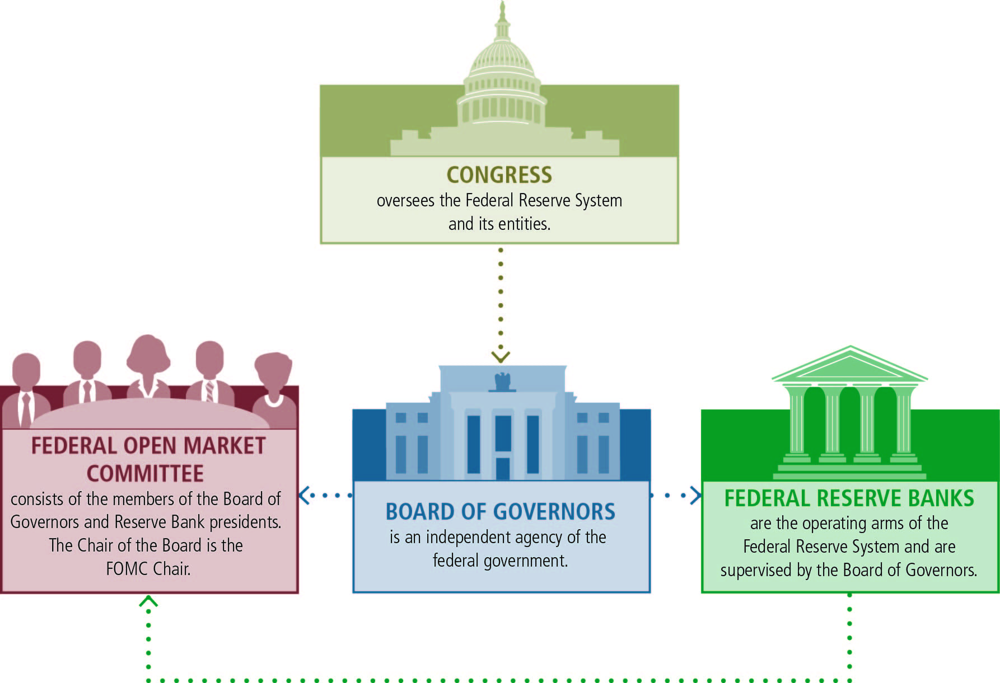
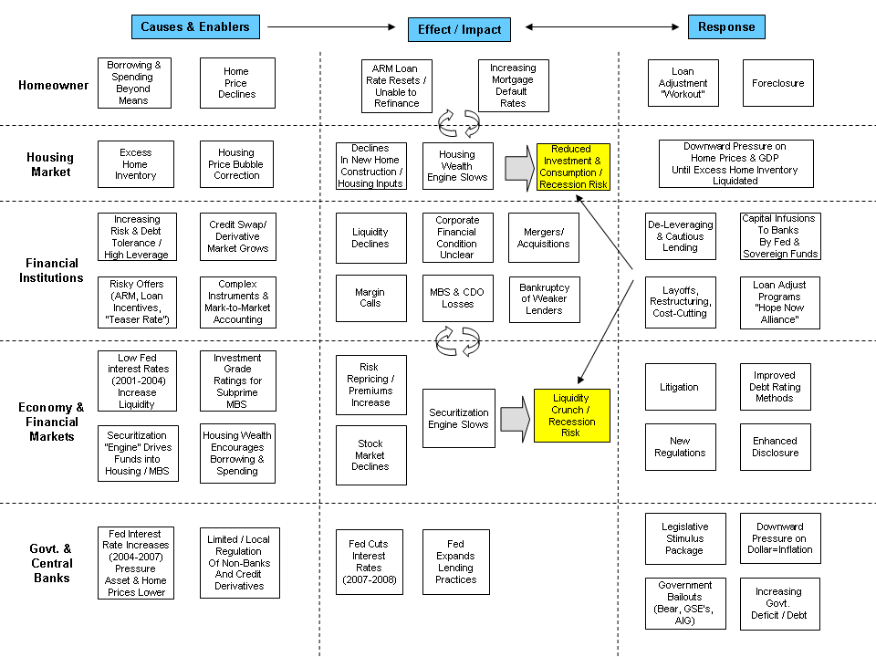
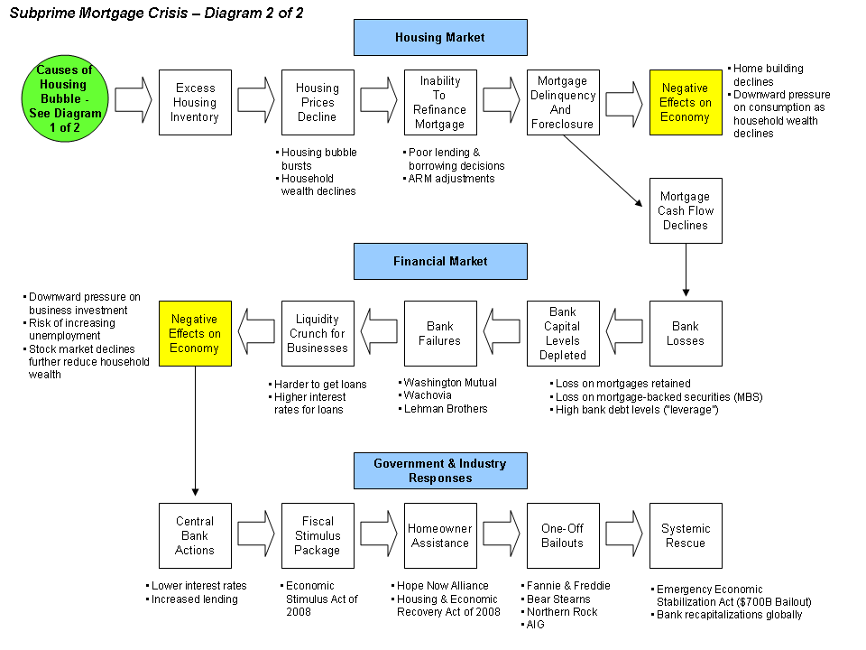

# History of the Federal Reserve

  -   In 1913, the Federal Reserve System was established

  -   The fed has a monopoly of money supply in the United States

  -   The Fed is a private institution with a public component

  -   The Board of Governors oversees the system
    
      -   7 members who are appointed 14 year terms by the president and
          approved by the Senate
    
      -   Chairs are appointed to renewable 4-year terms

# The Federal Reserve Structure

  

  -   12 Federal Reserve Banks each in charge of their district
    
      -   **Audit books of private-sector banks** to ensure banks are
          financially sound
    
      -   New York Fed plays the special role of carrying out
          **open-market operations**

  -   Federal Open Market Committee (FOMC) makes decisions about
      monetary policy
    
      -   Board of Governors plus the New York Fed Presidents and 4
          rotating Bank Presidents of the other 11
  Districts

  

# Function of the Federal Reserve

  -   Provide Financial Services
    
      -   Serve as the "**banker's bank**" as well as the **bank for the
          United States**
    
      -   The government has a **checking account** with the Fed through
          the **U.S. Treasury**

  -   Supervise and Regulate Banking Institutions
    
      -   Charged with **ensuring** the **soundness** of the nation's
          **banking** and **financial system**
    
      -   Both the **District Banks** and **Board of Governors examine**
          and **regulate commercial banks**

  -   Maintain the Stability of Financial System
    
      -   Provide **liquidity** to financial institutions
    
      -   Provided a "**discount window**" for banks after the evens of
          9/11

  -   Conduct Monetary Policy
    
      -   Chief function of the Federal Reserve
    
      -   Board of Governors use **monetary policy** tools to address
          the **macroeconomic fluctuations** that occur in the economy

# Reserve Requirement and Discount Rate

  -   Reserve Requirement
    
      -   Banks are required to hold on to **10%** of its **checkable
          bank deposits**
    
      -   The Fed will **rarely change** this rate. Last change occurred
          in 1992
    
      -   If money falls below, then banks will **borrow** from other
          banks through the federal funds markets
    
      -   **Interest** rate that **banks** borrow from other banks rate
          is the **federal fund rate**
    
      -   If **RRR increase**, the **money supply decreases**
    
      -   If **RRR decrease**, the **money supply increase**

  -   Discount rate
    
      -   Interest rate the **Fed** charges **directly**
    
      -   **Rarely** used to actively manage money
supply

# Open Market Operations

  -   The Fed will buy or sell U.S. Treasury bills through a commercial
      bank
    
      -   When the Fed **buys** bonds, the **money supply increases**
    
      -   **Buying** bonds will "**bloat**" the money supply
    
      -   When the Fed **sells** bonds, the **money supply decreases**
    
      -   **Selling** bonds will "**shrink**" the money supply

  -   How does the Fed purchase U.S. Treasury bills from banks?
    
      -   Fed will create money that heretofore **never existed** into
          **existence**
    
      -   Remember, we have **a fiat currency**
    
      -   Money supply increases via the monetary base

  ![The Fed buys securities in the open market Bank reserves increase,
  and the quantity of money increases Interest rates fall The dollar
  falls on the foreign exchange market Net Consumption exports and
  investment Increase Increase Aggregate demand Increases Real GDP
  growth and inflation speed up The Fed sells securities in the open
  market Bank reserves decrease, and the quantity of money decreases
  Interest rates rise The dollar rises on the foreign exchange market
  Consumption Net and investment exports decrease decrease Aggregate
  demand decreases Real GDP growth and inflation slow down
  ](./media/image62.png)

# The Financial Crisis of 2008

  
  
  

# Practice Questions

  -   Which of the following is NOT a role of the Federal Reserve
      System?
    
    a.   Controlling monetary policy
    
    b.   Controlling fiscal policy
    
    c.   Setting a target federal funds rate
    
    d.   Supervising and regulating banks
    
    e.   Determining the Required Reserve Ratio

  Answer: b

  -   When the Fed makes a loan to a commercial bank, it charges
    
    a.   No interest
    
    b.   The federal funds rate
    
    c.   The discount rate
    
    d.   The prime rate
    
    e.   A fixed interest rate of 10%

  Answer: c

  -   If the Fed purchases U.S. Treasury bills from a commercial bank,
      what happens to bank reserves and the money supply?
    
    a.   Both increase
    
    b.   Both decrease
    
    c.   Bank reserves increase, money supply decreases
    
    d.   Bank reserves decrease, money supply increases
    
    e.   Bank reserves increases, no change in money supply

  Answer: a
  
  
  
   
  
  

  -   What are the three traditional tools of monetary policy used by
      the Fed? Which method is preferred?
    
      -   Discount Rate
        
          -   rate that banks are charge directly by the Fed
        
          -   ↑ Discount Rate, ↓ money supply
        
          -   ↓ Discount Rate, ↑ money supply
    
      -   Required Reserve Ration (RRR)
        
          -   ↑ RRR, ↓ money supply
        
          -   ↓ RRR, ↑ money supply
    
      -   Open-Market Operation (Preferred method)
        
          -   Buy government securities will increases money supply
              (BUY=BLOAT)
        
          -   Sell government securities will decrease money supply
              (SELL=SHRINK)