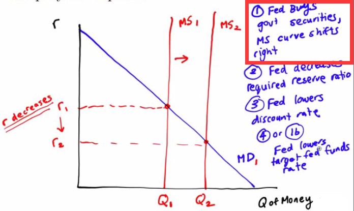

# Opportunity Cost of Holding Money

  -   The decision to **hold onto cash** has an **opportunity cost**.
      It's money that **can't be used to invest** in other assets

  -   In June 2007, the federal funds rate was 5.25%

  -   In June 2008, the federal funds rate dropped to 2.00%

  -   In June 2009, the federal funds rate set to 0.0 - 0.25%

  -   **Interest rate** you get on **cash** is **0.0%**

  -   The opportunity of cost of money has **decreased** over that
      two-year time span

# The Money Demand Curve

  

# Shifts of the Money Demand Curve 

  

  -   Changes in the Aggregate Price Level
    
      -   **Higher prices** have led to an **increase** in the
          **demand** for **money**
    
      -   Demand for money is **proportional** to the **price level**.
    
      -   If prices rise by 10%, demand increases by the same amount

  -   Changes in Real GDP
    
      -   As real GDP increases, the **larger quantity** of **money**
          that households and firms will hold

  -   Changes in Technology
    
      -   **Availability of ATMs** and widespread acceptance of **credit
          purchases** decreases money demand

  -   Changes in Institutions
    
      -   Regulation Q barred interest-bearing checking.
    
      -   When eliminated in 1980, MD shifted to the right

# Money and Interest Rates

  -   The Federal Open Market Committee (**FOMC**) is in charge of
      setting the target **federal funds rate**
    
      -   The Federal Reserve **doesn't** actually set the federal funds
          rate **by fiat**
    
      -   The Open Market Desk at the New York Fed **buys (or sells)
          bonds** in order to achieve the target

  -   When the Fed **lowers** the **federal funds rate**, other
      **short-term interest rates** (CD rates) **fall** in a
      corresponding matter

  -   In an era of a **0% federal funds rate**, the opportunity cost of
      holding onto money is about as **low** as you can get

# Liquidity Preference Model

  -   Liquidity Preference Model of the Interest Rate
    
      -   **Interest rate** in money market is determined by the
          **supply** and **demand** for **money**
    
      -   Combine the **MD**, which is downward sloping with the **MS**,
          which is the quantity of **money supplied** by the Federal
          Reserve

  -   The Fed can either **increase** or **decrease** the **money
      supply** using one of its **three monetary policy tools**
    
      -   Open Market Operations
    
      -   Changing Reserve Requirements
    
      -   Lending through the Discount Window

![Discount Rate Raise Lower Reserve Requirement Raise Lower Open Market
Operations Buying Selling Effect Less money More money Effect Less money
More money Effect More money Less money Reason Banks borrow less money
because Of higher interest. Banks have more money in reserves. Reason
Banks are required to keep more and lend less to borrowers. Banks keep
less in vaults and lend more to borrowers. Reason The Fed gives money to
banks in exchange for bonds. The Fed takes money from banks in exchange
for bonds. ](./media/image69.png)

  -   Equilibrium in the Money Market

  
  
  ![Machine generated alternative text: MSO 9 0 M52 Decrease in money
  supply \] 5e5 rate Increase in money supply lowers 《 nterest rate M51
  MD Real money (trillions of 2 佣 5 dollars) ](./media/image71.png)

# Practice Questions 

  -   Which of the following will decrease the demand for money?
    
    1.   An increase in interest rates
    
    2.   A rising level of inflation
    
    3.   An increase in GDP
    
    4.   An increase in the availability of ATMs
    
    5.   A decrease in interest rates

  Answer: d
  
  Option a is change the quantity demanded, not the demand itself

  -   If the Fed sells Treasury securities, what happens to the money
      supply and the equilibrium interest rate? Graph your response

  

  -   SELL = SHRINK

<!-- end list -->

  -   If the Fed buys Treasury securities, what happens to the money
      supply and the equilibrium interest rate? Graph your response

  

  -   BUY = BLOAT