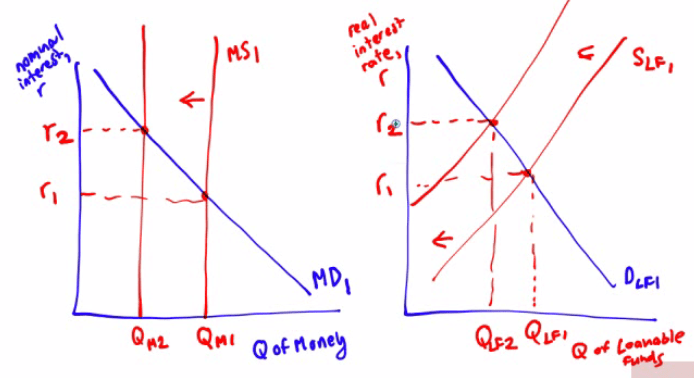
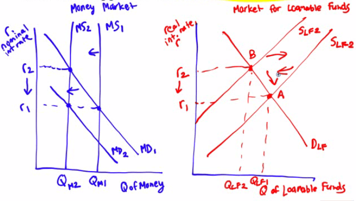

#  Loanable Funds Market

  -   Loanable funds market
    
      -   **hypothetical market** that illustrates the market outcome of
          the **demand** for **funds** generated by **borrowers** and
          the **supply** of **funds** provided by **lenders**

  -   **Savers** are the ones who **save** the money and thus are more
      willing to lend out at **higher rates** of return

  

  -   **Borrowers** (ie. firms with investment spending projects) prefer
      **lower interest rates**

  

  -   Equilibrium in the Loanable Funds Market
    
      -   **quantity** of funds that **savers** want to **lend** equals
          the **quantity** of funds that **businesses** want to
          **borrow**

  

# Shift of Demand for Loanable Funds

  

  -   Changes in **perceived** business **opportunities **
    
      -   If businesses see **opportunities** of **higher return**, the
          demand for loanable funds will **increase**
    
      -   In the late 1990s with the dot com boom, firms were excited
          about any possible internet company out there and the demand
          for loanable funds increased to right

  -   Changes in the government's borrowing
    
      -   When governments **incur** a **deficit**, the demand for
          loanable funds will **increase**
    
      -   **Crowding out** occurs when interest rates **increase** and
          therefore, businesses will **invest less**. Thus, the crowding
          out effect

# Shift of Supply for Loanable Funds

  

  -   Changes in private saving behavior
    
      -   Between 2000 and 2006, rising home prices caused people to
          "**feel richer**" and therefore **spend more** and **save
          less**
    
      -   The **supply** of loanable funds, therefore, would shift to
          the **left** as a result

  -   Changes in capital inflows
    
      -   With a large **inflow** of **capital funds**, the supply of
          loanable funds shifts to the **right**
    
      -   Conversely, when **international investors flee** (like in
          Argentina), the supply of loanable funds shift to the **left**

# Inflation and Interest Rates

  

  -   **Inflation** will tend to **help borrowers** and **hurt savers**

  -   In the late 1970s and early 1980s, homeowners "won" with inflation
      and banks "lost" with inflation

  -   **Real interest rate = Nominal interest rate - inflation rate**

  -   The **true cost** of borrowing is the **real**, not nominal,
      interest rate\!

  -   A good "hedge" against inflation would be to **buy** a **house**
      and take on a low-interest rate mortgage and invest in **other
      assets**, perhaps the stock market

  -   Fisher effect
    
      -   The expected real interest rate is **unaffected** by the
          change in **expected future inflation**.
    
      -   Borrowers and lenders base decisions on the **expected real
          interest rate** not the nominal

# Interest Rate in the Short Run 

  -   A **fall** in the **interest rates** leads to a **rise** in
      **investment spending**, which leads to a **rise** in **GDP**,
      which leads to a **rise** in **savings**

  -   In the money market, an **increase** in the **money market** shift
      the **MS** to the **right**, **lowering r**

  -   In the short run, the **loanable funs market follows** the lead of
      the **money market**.

  -   The change in GDP **increase** savings(investment) and **shifts**
      supply of loanable funds to the right

# Interest Rate in the Long Run

  -   In the long run, however, when the **money supply increases**, the
      **aggregate price level increase** and therefore the **money
      demand increase** in the same proportion

  -   So, MS1 shifts to MS2, but MD1 shifts to MD2, which raises the
      interest **back** to its **original level**

  -   As a result, the supply of loanable funds which originally shifted
      to the right, shifts back to the left, **back** to its **original
      level**\!

  -   **In the long run, money doesn't matter\!**

  -   The **supply** and **demand** for **loanable** funds
      **determines** the interest in the **long run**

# Practice Question 

  -   If the Fed sells government securities, what happens in the money
      market? What will happen in the loanable funds market in the
      short-run?

  

  -   In the long-run, if the Fed sells government securities, what
      happens in the money market? What will happen in the loanable
      funds market?

  

  -   Does each of the following affect either the supply or demand for
      loanable funds, and if so, does the affected curve shift to the
      right or shift to the left
    
      -   Decreases in capital inflow into the economy

  ↓ Supply of Loanable Funds, Shift Left

  -   Business are optimistic about future business conditions

  ↑ Demand for Loanable Funds, Shift Right

  -   The government decreases borrowing

  ↓ Demand for Loanable Funds, Shift Left

  -   The private savings rate increases

  ↑ Supply of Loanable Funds, Shift Right