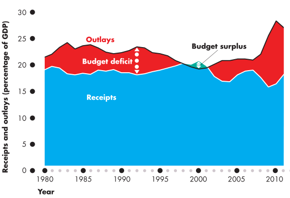
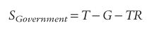
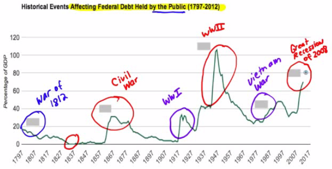
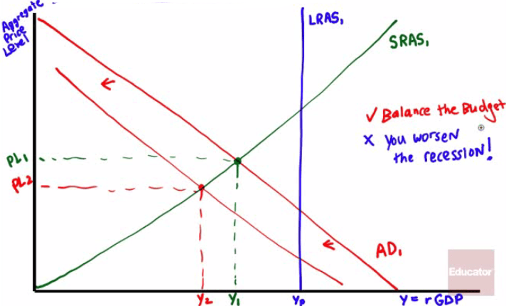

# The Budget Balance

  

  -   **Government savings** is defined by the following equation:
    
      -   
    
      -   T: Tax Revenues
    
      -   G: Government purchases of goods & services
    
      -   TR: Government transfers

  -   As a rule of thumb, **expansionary** fiscal policies server to
      **reduce** the **budget balance** (ie. decrease budget surplus or
      increases budget deficit)
    
      -   increase government spending
    
      -   decrease taxes
    
      -   increase transfer payments

  -   Generally, **contractionary** fiscal policies will **increase**
      the **budget balance** (ie. increase budget surplus or decrease
      budget deficit)
    
      -   decrease government spending
    
      -   increase taxes
    
      -   decrease transfer payments

  

# Cyclically Adjusted Budget Balance

  -   An estimate of what the budget balance would be if real **GDP**
      were exactly **equal to potential output**

  -   Government **tax** revenue tends to **rise** and **government
      transfers fall** during **economic expansions**. **Budget** tend
      towards a **surplus**

  -   Conversely, **tax** receipts **decrease** and **government
      transfers** increase during **contractions**. **Budget** tend
      towards a **deficit**

  

# Should the Budget Be Balanced

  -   This is a **normative** question\!

  -   A **balanced budget amendment nearly passed** through Congress to
      be sent to the states for ratification in 1994, falling 4 votes
      short of the 2/3rd Senators necessary (63-67)

  -   A good number of economists would argue against an amendment as
      that would **restrict** a country's **ability** to run a **budget
      deficit** during recessions. **Recessions** would be
      **worsened**\!

  -   However, when large **deficits persist** year after year, the
      **national debt grows** and grows and grows and grows…

  -   The National Debt in February 2014 ~$17.3 trillion

# Problems of a Rising Government Debt

  -   "Crowding out" effect

  -   When the **government borrows funds** in the financial markets, it
      competes with **private firms** and "**crowds out**" **private
      spending** by **raising interests rates** and **reducing**
      long-run **economic growth**

  -   Today's deficits increase the public debt and so puts financial
      strains on **future budgets**

  -   Like a consumer maxed out on credit cards, a government with
      rising amount of debt may eventually **default on payment**

  -   In 2001, Argentia **defaulted** on its payments and caused
      **havoc** in the country's economy and a **serve recession**

  -   So why not print money to pay off the debt??

  -   Inflation\!\!\!

  

# Trends in Debt-GDP Ratio

  

  -   During times of **war**, the US has trended towards runing a
      budget **deficit**

  -   During **World War II**, the government ran up a **huge deficit**,
      and so the US Debt-GDP ratio was **over 100%** at its peak

  -   In 2012, during "relative" peace, the US Total Debt-GDP ratio
      exceeded 100%

  -   With projected **budget deficits** to **continue**, the debt will
      continue to get **larger** and **larger**

  -   Some troubled countries in 2013
    
      -   Greece 173% Debt-GDP ratio
    
      -   Japan 140% Debt-GDP ratio

# Implicit Liabilities 

  -   **Spending promises** made by the government but **not included**
      in the **actual debt totals**

  -   Three largest implicit liabilities of the American Government
    
      -   Social Security
    
      -   Medicare
    
      -   Medicaid

  -   **If included** in the national debt, the $17.3 trillion figure
      (Feb 2014) would actually **much higher**

  -   If the government prepared its financial reports the way private
      companies do, the net present value of all debt would be closer to
      $100 trillion\!

  

# Practice Questions

  -   Drawn an AD-AS graph an economy in a recession. What will happen
      if the government increase taxes and decreases spending to reduce
      the deficit and lower the national
  debt?

  

  -   If government spending exceeds tax revenues which of the following
      is necessarily true?
    
    a.   Positive budget balance
    
    b.   Budget deficit
    
    c.   Recession

  Answer: b

  -   Which of the following fiscal policies is contractionary
    
    a.   Increasing taxes by $100 billion and increasing spending by
          $100 billion
    
    b.   Decreasing taxes by $100 billion and Decreasing spending by
          $100 billion
    
    c.   Increasing taxes by $100 billion and decreasing spending by
          $100 billion
    
    d.   Decreasing taxes by $100 billion and increasing spending by
          $100 billion
    
    e.   None of the above

  Answer: c

  -   Which of the following is reason to be concerned about perpetural
      beget deficits?
    
    a.   Crowding out
    
    b.   Government default
    
    c.   The opportunity cost of future interest payments
    
    d.   Higher interest rates leading to decrease long-run growth
    
    e.   All the above

  Answer: e
