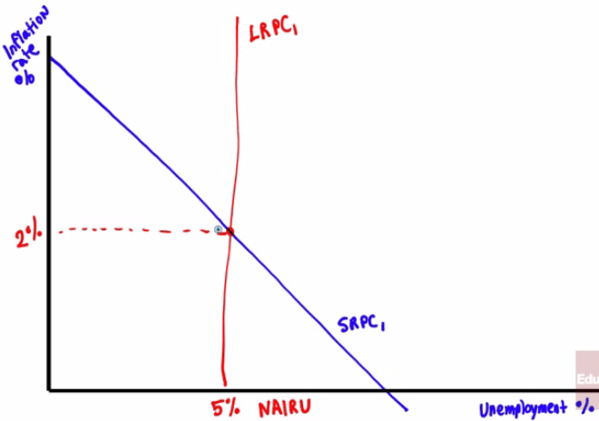

# The Short-Run Phillips Curve

  -   In 1958, New Zealand-born economist Alban W.H. Phillips found that
      when the **unemployment rate** was **high**, **wage rates** tended
      to **fall**

  -   Conversely, when the **unemployment rate** was **low**, **wage
      rates** tended to **rise **

  -   Using data in the 1950s and the 1960s, the simple negative
      relationship between inflation and unemployment generally held
      true

  -   Graph

  

# Inflation Expectations

  -   Changes in **expected inflation** will affect the Short-Run
      Phillips Curve (**SRPC**)

  -   An **increase** in **expected inflation** shifts the short-run
      Phillips curve **upward**

  -   People will tend to base their expectations of inflation based on
      their experiences

  -   When people were accustomed to **low inflation** rates, the
      correctly reasoned (at the time) that **future inflation rates**
      would also be **low**

# Inflation and Unemployment in the Long Run 

  -   Most economists believe that in the **long-run**, there is **no
      trade-off** between unemployment and inflation

  -   To **avoid accelerating inflation** overtime, the **unemployment**
      rate must be **high enough** that the **actual rate** of inflation
      **matches** the **expected rate** of inflation

  -   The **unemployment rate** at which inflation does **not change**
      over time is known as the **nonaccelerating inflation rate of
      unemployment**, or **NAIRU**

  -   The Long-Run Phillips Curve (**LRPC**) is the relationship between
      **unemployment** and **inflation after expectations** of
      unemployment have had **time to adjust** over time

  -   Graph

  

# The Costs of Disinflation 

  -   Generally, politicians and economists have found that bringing
      **inflation down** is much **harder** than **increasing** it

  -   In the early 1980s, the United States used **contractionary
      policies** which brought about **disinflation**

  -   Policy makers reasoned that the long-term benefit of controlling
      **double-digit inflation** was **worth** the short-term **pain**
      that totaled an equivalent of nearly $2.6 trillion (2010 dollars)

  -   A **clear policy** of announcing of policy of **disinflation**,
      some economists argue, helped in **easing** the **pain**

# The Costs of Deflation

  -   **Deflation** is the **fall** in the aggregate price level, which
      was a common occurrence before World War II in the United States

  -   After WWII, inflation became the norm. But, in the 1990s,
      deflation reemerged in Japan

  -   Why is deflation bad? Aren't lower prices good?

  -   In deflation, **lenders gain** and **borrowers lose** since a
      **dollar** has **more purchasing power** in the **future**

  -   The effect of deflation, ultimately, leads to a **reduction** of
      **aggregate demand** which, many economists will argue, played a
      significant role in the **Great Depression**

# Practice Questions

  -   An increase in expected inflation will do which of the following?
    
    1.   Shift the SRPC downward
    
    2.   Shift the SRPC upward
    
    3.   Shift the LRPC upward
    
    4.   Shift the LRPC downward
    
    5.   None of the above

  Answer: b

  -   Draw a correctly labeled graph showing a SRPC with an inflation
      rate of 2% and the NAIRU at
  5%

  

  -   Assume an economy is in a recession. Draw a correctly labeled
      graph showing the following (SRPC, LRPC, and point A, which
      represents the current state of recession)

  