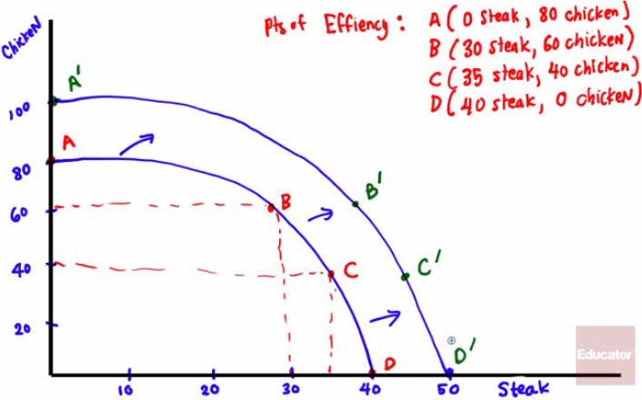
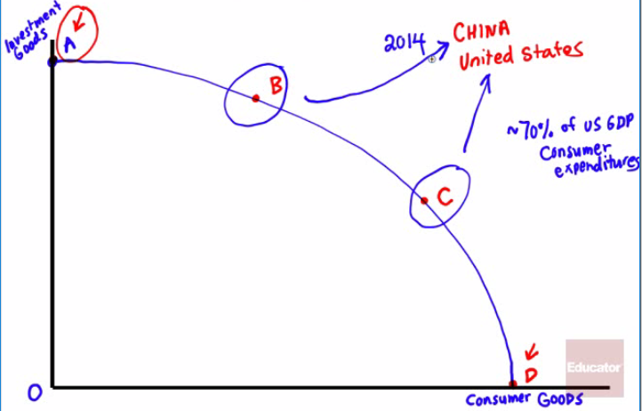
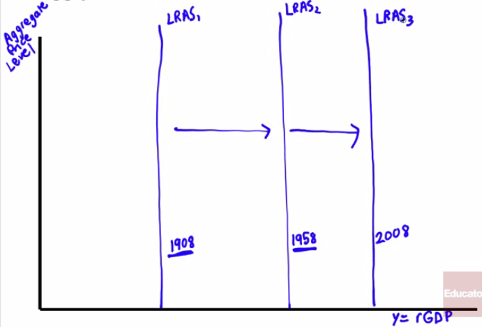
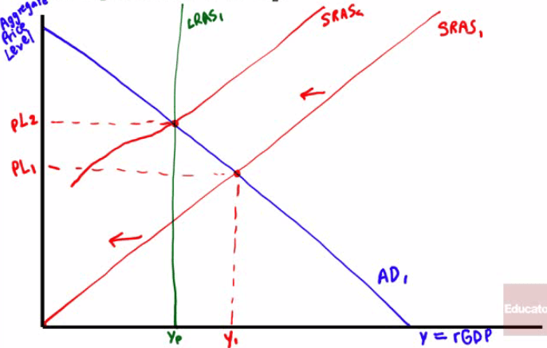
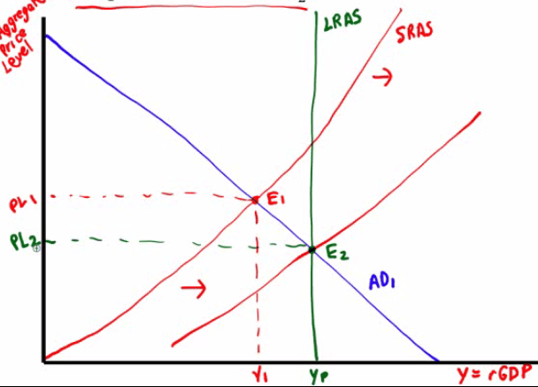

# Real GDP Per Capita

  

  -   Key statistic used to measure **economic growth** and **standard**
      of **living real GDP per capita**
    
      -   Real GDP divided by the population
    
      -   Not a policy goal itself, but a **useful summary** that
          measures a nation's **economic progress**

  -   In 2008, the median household income in the United States was
      ~$50,000

  -   In 1908, it was about 15% of that, or ~$8,000 in today's dollars

  -   In many countries today, the standard of living is less than it
      was in the United States over 100 years ago\!

  -   Why is that?

  

# Long Run Economic Growth

  

  -   Gradual progress of the real GDP per capita in the US increased by
      1.9% every year

  -   Sources of Growth
    
      -   Physical Capital
        
          -   **Building** and **machines** today make the average
              worker much more **productive**
              
              

        
      -   Human Capital
        
          -   Improvement in **labor** created by **education** and
              **knowledge** in the workforce 
              
              

              
      -   Technology
        
          -   **Technical means** for the production of goods and
              services

# Economic Growth on Graph

  -   PPF Graph
    
      -   **Economic growth** results in an **outward shift** of the
          production possibilities curve.

  

  -   In Parkland, point A (y-axis) represents all investment goods and
      point D represents all consumer goods (x-axis) with B and C in
      between

  

  -   LRAS Curve
    
      -   The growth in potential output over time can be shown as a
          **rightward shift** of the long-run aggregate supply curve

  

  -   SRAS curve
    
      -   Short-Run to Long-Run: Y1 \> YP
    
      -   Initial equilibrium is E1. Eventually, **low
          unemployment** will cause **nominal wages** to **rise** and
          leads to a **leftward** shift of the **SRAS curve**, so the
          new equilibrium is at
  E2

  
  
  

  -   Short-Run to Long-Run: Y1 \< YP

  -   Initial equilibrium is E1. Eventually, **high
      unemployment** will cause **nominal wages** to **fall** and leads
      to a **rightward** shift of the **SRAS curve**, so the new
      equilibrium is at E2

  
  
  

# Practice Questions

  -   Long-run economic growth depends almost entirely on
    
    a.   Technological change
    
    b.   Rising productivity
    
    c.   Increased labor force participation
    
    d.   Rising real GDP per capita
    
    e.   Population growth

  Answer: b

  -   In the AD-AS model, long-run economic growth is shown by a
    
    a.   Leftward shift of the AD curve
    
    b.   Rightward shift of the AD curve
    
    c.   Rightward shift of the LRAS curve
    
    d.   Rightward shift of the SRAS curve
    
    e.   Leftward shift of the SRAS curve

  Answer: c

  -   Which of the following is listed among the key sources of growth
      in potential output
    
    a.   Expansionary fiscal policy
    
    b.   Expansionary monetary policy
    
    c.   A rightward shift of the short-run aggregate supply curve
    
    d.   Investment in human capital
    
    e.   All of the above

  Answer: d