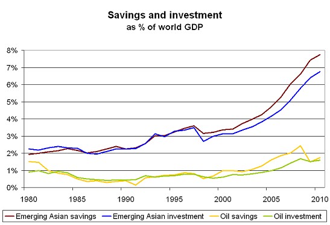
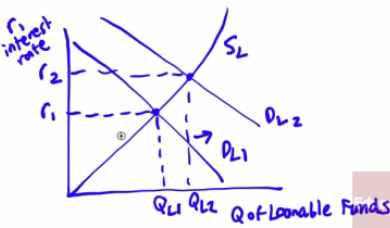

# Current Account

  -   Balance of payments on **goods** and **services** plus **net
      international transfer payments** and **factor income**

  -   **Sales and purchases of goods and services**
    
      -   Payments from foreigners: $2,000,000
    
      -   Payments to foreigners: $2,500,000
    
      -   Net: -$500,000

  -   **Factor Income**
    
      -   Payments from foreigners: $800,000
    
      -   Payments to foreigners: $600,000
    
      -   Net: $200,000

  -   **International Transfers**
    
      -   funds sent by residents of one country to residents of another
    
      -   Net: -$100,000

  -   **Current Account (CA) = Net foreign sales of goods and services +
      net factor income + net international transfer** = -500,000 +
      200,000 - 100,000 = -400,000

  -   Current account deficit: CA \< 0

  -   Current account surplus: CA \> 0

  -   Another Example

  

# Financial Account

  -   The difference between a country's **sale of assets to
      foreigners** and **purchases of assets from foreigners** during a
      given period

  -   **Official asset sales and purchases**
    
      -   Payment from foreigners: $500,000
    
      -   Payment to foreigners: $600,000
    
      -   Net -$100,000

  -   **Private sale and purchases of assets**
    
      -   Payment from foreigners: $600,000
    
      -   Payment to foreigners: $100,000
    
      -   Net: $500,000

  -   Financial Account
    
      -   FA = -$100,000 + $500,000 = $400,000

  -   Another Example

  

# Balance of Payments Account

  -   Summary of a country's transactions with another country

  
  
  

  -   **Current Account (CA) + Financial Account (FA) = 0**

  -   Or, **CA = -FA**

  -   Payment to the US for goods and services, factor income, and
      transfers + Payments to the United States for assets = - (Payments
      to the rest of the world for goods and services, factor income,
      and transfers + Payments to the rest of the world for assets)

  -   A country's financial account measures its **net sales of
      assets**, such as currencies, securities and factories, **to
      foreigners**
    
      -   These assets are **exchanged** for **financial capital**
    
      -   Measure of **capital inflows** in the form of **foreign
          saving** that become available to finance **domoestic
          investment** spending

  

# Financial Account and Loanable Supplies

  -   Foreign Direct Investment
    
      -   Assume **all flows come** in the form of **loans**
    
      -   Purchases of stock in foreign companies and real estate as
          well as foreign direct investment, in which companies build
          factories or acquire other assets **directly**

  -   Exchange Rates
    
      -   We'll **ignore** the effects of **expected changes** in the
          **exchange rate** for now

  -   Assume that the equilibrium interest rate in The Loanable Funds
      Model is 4%

  

  -   Assume that the equilibrium interest rate in the US is 6% and that
      in Britain it is 2%. What will happen?
    
      -   Capital **inflow** to the United States and Capital
          **outflow** from Britain
    
      -   Investors **prefer higher real interest rates** to lower real
          interest rates

# GDP, GNP, and the Current Account

  -   The basic equation for national income accounting
    
      -   **Y = C + I + G + NX**
    
      -   **Y = C + I + G + X - IM**
    
      -   (NX = X - IM)

  -   Why doesn’t the national income equation use the current account
      as a whole?
    
      -   GDP it the value of goods and service produced **in a
          country**
    
      -   It does **not include international factor income** and
          **international transfers**

  -   **GNP**, or Gross National Product, does **include international
      factor income**

  -   Why do we use GDP and not GNP?
    
      -   The intent was to **track production** not income
    
      -   Data on **international factor income** and **transfer
          payments** generally considered **unreliable **

# Global Saving Glut

  -   In the early 21st century, the **United States** entered into a
      **massive current account deficit**
    
      -   The US **imports more than** it **exports** in a given year
    
      -   US takes in a lot of **capital inflow** form the rest of the
          world, most notably China

  -   How did this happen?
    
      -   Former Fed Chairman Ben Bernanke in 2005 (a Fed Governor at
          the time) said that this "global saving glut" led to **excess
          investment spending** in the US
    
      -   Because of the **financial crises** in the late 20th century,
          other countries found the US as an **attractive destination
          despite low interest
  rates**

  

# Practice Questions

  -   On a Loanable Funds graph, show what would happen if there are
      capital inflows to a country with a 6% interest rate? When supply
      increased, what happened to the interest
  rate?

  

  -   Which of the following will increase the demand for loanable fund
      in a country
    
    a.   Government budget surplus
    
    b.   Decreased private saving rate
    
    c.   A recession
    
    d.   Decreased investment opportunities
    
    e.   Economic growth

  Answer:
  e
  
  

  -   Suppose China decides to start a huge program of infrastructure
      spending, which it will finance by borrowing. How will this
      program affect the US Balance of Payments
    
    a.   CA increases, FA increases
    
    b.   CA decreases, FA decreases
    
    c.   CA decreases, FA increases
    
    d.   CA increases, FA decreases
    
    e.   None of the above

  Answer: d
  
  CA = - FA