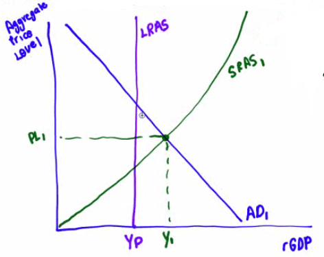

# The Scenario

  -   Assume the US economy is operating at an aggregate output level
      **above potential output**.

  -   Draw a graph showing **AD**, **SRAS**, **LRAS**, **equilibrium
      output** & **aggregate price level**.

  -   Now assume the Fed uses **contractionary** monetary policy.

  -   Identify the **open-market operation** the Fed would use and draw
      a **money market graph** to show the effect of monetary policy on
      the **nominal interest rate**.

  -   Show how the Fed's actions will affect equilibrium in the
      **aggregate demand** and **supply** graph you drew previously and
      the new **aggregate price level**.

  -   Draw a graph of the **foreign exchange market** for the US dollar
      relative to the Euro

  -   How will the Fed's contractionary monetary policy affect the real
      **interest rate** in the US?

# The Inflationary Gap

  -   Aggregate output level **above potential** output:
      **inflationary** gap

  -   Axes
    
      -   x-axis: Y = **rGDP** (real GDP)
    
      -   y-axis: **Aggregate Price Level**

  -   Aggregate Demand
    
      -   Consumer Expenditures + Business Investment + Government
          Expenditures + Net Exports
    
      -   Y = C + I +G + NX

  -   SRAS
    
      -   Up-ward sloping curve

  -   Equilibrium output & aggregate price level
    
      -   The intersection of AD and SRAS

  -   LRAS
    
      -   To the **left** of the equilibrium
    
      -   Aggregate output level is **above** the potential output

  -   Potential output (Yp)
    
      -   The intersection of LRAS and
  x-axis

  

# Money Market

<table>
<thead>
<tr class="header">
<th>Expansionary Monetary Policy</th>
<th>Contractionary Money Policy</th>
</tr>
</thead>
<tbody>
<tr class="odd">
<td><ul>
<li><blockquote>

Lower Discount Rate

</blockquote></li>
</ul></td>
<td><ul>
<li><blockquote>

Raise Discount Rate

</blockquote></li>
</ul></td>
</tr>
<tr class="even">
<td><ul>
<li><blockquote>

Lower RRR

</blockquote></li>
</ul></td>
<td><ul>
<li><blockquote>

Raise RRR

</blockquote></li>
</ul></td>
</tr>
<tr class="odd">
<td><ul>
<li><blockquote>

Buy Government Securities After Lowering Target Fed Funds Rate 
(<strong>Open Market Operation</strong>)

</blockquote></li>
</ul></td>
<td><ul>
<li><blockquote>

Sell Government Securities After Raising of Target Fed Funds Rate 
(<strong>Open Market Operation</strong>)

</blockquote></li>
</ul></td>
</tr>
</tbody>
</table>

  

  -   Axes
    
      -   x-axis: **Quantity of Money**
    
      -   y-axis: **Nominal Interest Rate** (r)

  -   Money Demand
    
      -   Downward sloping curve

  -   Money Supply
    
      -   **Straight Vertical Line**, since the Fed control the money
          supply
    
      -   **Expansionary**: MS **shifts** to the **right**, **lowing**
          the nominal interest rate
    
      -   **Contractionary**: MS **shifts** to the **left**, **raising**
          the nominal interest rate

  

# New Equilibrium

  -   **Higher interest rate = Decreased investment**

  -   When interest rates go up, both consumption and investment
      **decrease**.

  -   Y↓ = C↓ + I↓ + G +NX

  -   **Aggregate Demand↓**

  -   Aggregate Price **↓** as a result of **contractionary** monetary
      policy

  

# Exchange Market

  -   Axes
    
      -   x-axis: **Quantity of Dollars**
    
      -   y-axis: **Euros per Dollar**

  -   No effect in the long-run.

  -   Since **money** is **neutral**, monetary has a **short-run** but
      not a long-run impact

  -   Price level↓ Demand for US dollar↑

  -   Dollar has **appreciated**, because **demand** for US dollars has
      **increased**

  

# Major Factors that Shift Curves in Each Model

![Aggregate Demand and Aggregate Supply Short-run Aggregate Supply Curve
Long-run Aggregate Supply Curve Aggregate Demand Curve Expectations
Wealth Size of existing capital stock Fiscal and monetary policy Net
Exports Interest rates Investment spending Demand Curve Income Commodity
prices Nominal wages Productivity Business taxes Supply and Demand
Productivity Physical capital Human capital Technology Quantity of
resources Prices of substitutes and complements Tastes Consumer
expectations Number of consumers Demand Curve Investment opportunities
Government borrowing Supply Curve Input prices Prices of substitutes and
complements in production Technology Producer expectations Number of
producers Loanable Funds Market Supply Curve Private saving behavior
Capital inflows ](./media/image132.png)

