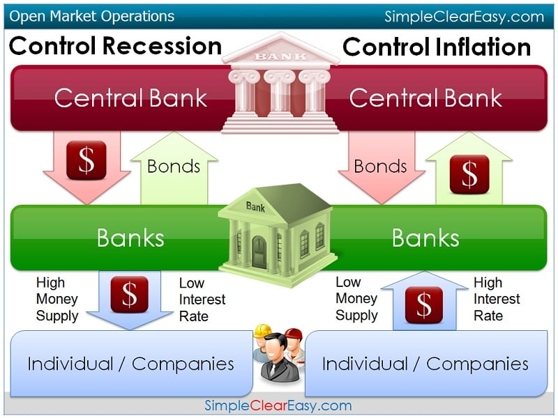
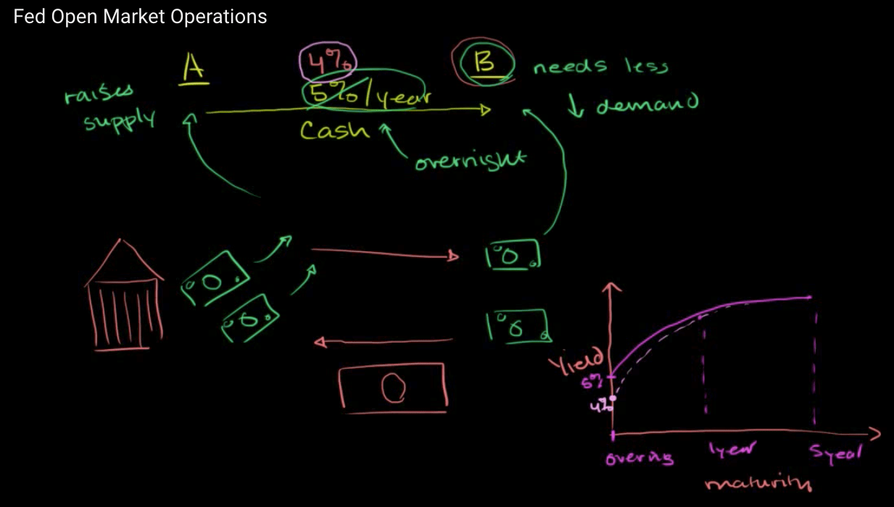
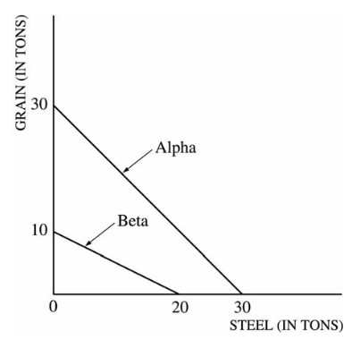

<a href="./exams/Practice Exam.pdf"  target="_blank" >Practice Exam</a>

# Question 6

  -   Purchase bond --\> decrease the interest rate

  

  -   Purchase bond --\> bloat the economy = increase the inflation rate
      --\> promote the employment

# Question 7

  -   Investment tax credits

  
  
  

# Question 10

  -   Consumer Price Index and Inflation

  
  
  ![We can then use the monthly CPI published by the Bureau of Labor
  Statistics to determine differences between two points in time and
  calculate inflation for that period. For example, let's compare the
  CPI of January 2000 with that of January 2010. The CPI of January 2000
  was 168.800 with the index for January 2010 listed as 216.687. To make
  the calculations, we take the more recent CPI, subtract the oldest
  CPI, and then divide by the oldest CPI. Using our numbers shown above,
  it would be 216.687, minus 168.800, divided by 168.800. This equals
  .2837. Inflation is always considered as a percentage, so we take that
  number and multiply it by 100 toget 28.37%. Thus, the inflation rate
  from January 2000 to January 2010 was 28.37%. By looking at these
  calculations, it becomes easier to understand that the Consumer Price
  Index is a factor in determining inflation.
  ](./media/image278.png)

# Question 12

  
  
  
  
  

# Question 25

  -   Budget deficit and interest rate

  
  
  

# Question 26

  

  -   Increasing household income in the U.S. results in more demand for
      foreign goods which appreciates that currency and depreciates the
      dollar.

# Question 27

  -   Causes of Stagflation
    
      -   If the prices of raw material and labour increases, it will
          increase the cost of production prices will rise and output
          will fall.
    
      -   Rapid rise in indirect taxes also increase the cost and price
          level. So output and employment falls.
    
      -   Shortage of labour also affects the output adversely.

  
  
  

# Question 34

  

  -   Alpha is getting 1 S domestically for their 1 G, but now they can
      trade their 1 G for 1.5 S.

  -   Beta is having to give up 2 S to get 1 G domestically, but if they
      trade they only have to give up 1.5 S to get 1 G.

# Question 35

  ![From the Short Run to the Long Run Aggregate price level (a)
  Leftward Shift of the Short-Run Aggregate Supply Curve LUS SRAS2 SRASI
  A rise in nominal wages shifts SRAS leftward. Real GDP Aggregate price
  level (b) Rightward Shift of the Short-Run Aggregate Supply Curve susl
  SRAS2 A fall in nominal wages shifts SRAS righ tward. Real GDP In
  panel (a), the initial short-run aggregate supply curve is SRA\*. At
  the aggregate price level, PI, the quantity of aggregate output
  supplied, Yl, exceeds potential output, Yp. Eventually, low unem-
  ployment will cause nominal wages to rise, leading to a leftward shift
  of the short-run aggregate supply curve from SRA\* to SRA$. In panel
  (b), the reverse happens: at the aggregate price level, PI, the
  quantity of aggregate output supplied is less than po- tential output.
  High unemployment eventually leads to a fall in nominal wages over
  time and a rightward shift of the short-run ag- gregate supply curve.
  ](./media/image286.png)

  -   Short-Run to Long-Run: Y1 \> YP
    
      -   Initial equilibrium is E1. Eventually, **low
          unemployment** will cause **nominal wages** to **rise** and
          leads to a **leftward** shift of the **SRAS curve**, so the
          new equilibrium is at E2

  

  -   Short-Run to Long-Run: Y1 < YP
    
      -   Initial equilibrium is E1. Eventually, **high
          unemployment** will cause **nominal wages** to **fall** and
          leads to a **rightward** shift of the **SRAS curve**, so the
          new equilibrium is at E2

  

# Question 37

  
  
  
  
  

# Question 40

  

  -   Expansionary monetary policy would result in lower interest rates,
      causing more investment in real capital.

  -   To keep prices from going up, policymakers could cut G or raise
      taxes \[contractionary\] to prevent this.

# Question 42

  -   Lower production costs --\> more profits + shifts the AS to the
      right --\> lower price level + increase in real output

# Question 43

  
  
  With no intervention in this recession, the surpluses would result in
  lower prices

  -   Workers would then accept lower wages. As more are hired back,
      output would increase.

# Question 47

  -   Decreasing taxes would increase C, increase AD and real GDP.
      Assuming a balanced budget before the decrease in T means the G
      would have to borrow, pushing up interest rates.

  -   Decreasing the discount rate would also lead to more real GDP but
      would result in a lower interest rate.

  -   With interest rates moving in opposite directions with the two
      policies, this make them indeterminate.

  

# Question 53

  

  -   The decrease in AD resulted in surpluses & caused prices to drop.

  -   Workers would now accept lower wage increases which moved the SRAS
      curve right, increasing real GDP.

  
  
  

# Question 56

  ![Gross Private Domestic Investment (I) I = the purchase of new
  capital goods or total investment by the private sector. It includes
  the purchase of new housing, plants, equipment, & inventory by the
  private sector. Nonresidential investment includes expenditures by
  firms for machines, tools, plants. Residential investment includes
  expenditures by households & firms on new houses. Change in
  inventories computes the amount by which firms' inventories change
  during a given period. Inventories are the goods that firms produce
  now but intend to sell later. ](./media/image291.png)

# Question 57

  -   The Relationship Between the Phillips Curve and AD

  
  
  ![The Phillips curve shows the inverse trade-off between rates of
  inflation and rates of unemployment. If unemployment is high,
  inflation will be low; if unemployment is low, inflation will be high.
  The Phillips curve and aggregate demand share similar components. The
  Phillips curve is the relationship between inflation, which affects
  the price level aspect of aggregate demand, and unemployment, which is
  dependent on the real output portion of aggregate demand.
  Consequently, it is not far-fetched to say that the Phillips curve and
  aggregate demand are actually closely related. To see the connection
  more clearly, consider the example illustrated by . Let's assume that
  aggregate supply, AS, is stationary, and that aggregate demand starts
  with the curve, ADI. There is an initial equilibrium price level and
  real GDP output at point A. Now, imagine there are increases in
  aggregate demand, causing the curve to shift right to curves AD2
  through AD4. As aggregate demand increases, unemployment decreases as
  more workers are hired, real GDP output increases, and the price level
  increases; this situation describes a demand-pull inflation scenario.
  ](./media/image293.png)
  
  

# Question 59

  -   Business taxes are determinants of both AD and AS.

  -   The decrease in business taxes means they have more profits and
      will invest more, increasing AD.

  -   As far as the legal-institutional environment with the government,
      it is more favorably so that will result in an increase in AS

# Question 60

  -   The budget deficit means the government is borrowing more, which
      pushes up the interest rate.

  -   The higher interest rate attracts more foreign investors,
      increasing demand for the dollar and appreciating the dollar.

  -   The stronger dollar makes our exports more expensive and imports
      cheaper, therefore increasing the trade deficit.

  
