Sample Questions

Friday, February 3, 2017

11:04 AM

# Question 1 

  -   **Labor-hours is the input NOT the output **

<table>
<thead>
<tr class="header">
<th>Labor-hours</th>
<th>Fish</th>
<th>Wheat</th>
</tr>
</thead>
<tbody>
<tr class="odd">
<td>Country A</td>
<td>10</td>
<td>20</td>
</tr>
<tr class="even">
<td>Country B</td>
<td>20</td>
<td>60</td>
</tr>
</tbody>
</table>

  -   Convert to the **quantity of outputs**, assuming the labor-hours
      is 60

<table>
<thead>
<tr class="header">
<th>Quantity</th>
<th>Fish</th>
<th>Wheat</th>
</tr>
</thead>
<tbody>
<tr class="odd">
<td>Country A</td>
<td>6</td>
<td>3</td>
</tr>
<tr class="even">
<td>Country B</td>
<td>3</td>
<td>1</td>
</tr>
</tbody>
</table>

  -   Country A has CA in wheat

  -   Country B has CA in fish

# Question 3

  -   In a **inflationary** gap, the following occurs
    
      -   An initial **positive demand shock** (**real estate market
          booms**)
    
      -   **AD** shifts to the **right**, and so the aggregate price
          level and aggregate output increase, which leads to **higher
          inflation** in the short-run and **reduces unemployment**
    
      -   Eventually, an **increase** in nominal **wages** in the long
          run **decreases** the **SRAS** and **moves** the economy
          **back to potential output**

  

  -   **Contractionary Fiscal Policy**
    
      -   Use **contractionary** fiscal policy to **decrease aggregate
          demand** in order to get the economy **back to** its
          **potential output**
        
          -   Decrease government spending (direct impact)
        
          -   Increase taxes
        
          -   Decrease in government transfers
    
      -   Graph

  

# Question 4

  -   Crowding-out effect
    
      -   When the **government borrows funds** in the financial
          markets, it competes with **private firms** and "**crowds
          out**" **private spending** by **raising interests rates** and
          **reducing** long-run **economic
growth**

# Question 5

  -   

  -   

  -   MPC + MPS = 1

# Question 6

<table>
<thead>
<tr class="header">
<th>Government Spending</th>
<th>Money Multiplier</th>
<th></th>
</tr>
</thead>
<tbody>
<tr class="odd">
<td>Taxes</td>
<td>Tax Multiplier</td>
<td></td>
</tr>
</tbody>
</table>

  -   When raising government spending and the taxes by the same amount,
      the **impact** of **government spending** will be **greater** than
      that of
  taxes

# Question 7

  

<table>
<thead>
<tr class="header">
<th>Expansionary Monetary Policy</th>
<th>Contractionary Money Policy</th>
</tr>
</thead>
<tbody>
<tr class="odd">
<td><ul>
<li><blockquote>

<strong>Lower Discount Rate</strong>

</blockquote></li>
</ul></td>
<td><ul>
<li><blockquote>

<strong>Raise Discount Rate</strong>

</blockquote></li>
</ul></td>
</tr>
<tr class="even">
<td><ul>
<li><blockquote>

<strong>Lower RRR</strong>

</blockquote></li>
</ul></td>
<td><ul>
<li><blockquote>

<strong>Raise RRR</strong>

</blockquote></li>
</ul></td>
</tr>
<tr class="odd">
<td><ul>
<li><blockquote>

<strong>Buy</strong>/<strong>Bloat</strong> Government Securities After Lowering Target Fed Funds Rate 
(<strong>Open Market Operation</strong>)

</blockquote></li>
</ul></td>
<td><ul>
<li><blockquote>

<strong>Sell</strong>/<strong>Shrink</strong> Government Securities After Raising of Target Fed Funds Rate 
(<strong>Open Market Operation</strong>)

</blockquote></li>
</ul></td>
</tr>
</tbody>
</table>

# Question 9

  -   **Expansionary monetary policy → r↓**

  

  -   **Expansionary Fiscal Policy → Spend more money → Crowding-out
      effect → r↑ **

  

  -   Expansionary policy will **shift AD** to the **right**,
      **increase** the **GDP**, therefore **unemployment** will
      **decrease**

# Question 10

  -   **Sell securities = Shrink money supply = decrease total loans by
      banks**

# Question 11

  -   If the **reserve ratio** is **low**, **more money** circulate, so
      Fed will have **more effect** on rGDP

# Question 12

  -   **Labor productivity↑ → AS↑ → Price Level↓ & rGDP↑**

  

# Question 14

  -   Phillips curve
    
      -   x-axis: unemployment rate
    
      -   y-axis: inflation rate

  -   Short-run Phillips curve

  

  -   Long-run Phillips curve

  

  -   In short-run
    
      -   **High inflation rate, low unemployment rate**
    
      -   **Low inflation rate, high unemployment rate**

# Question 16

![Factors that Shift the Short-Run Aggregate Supply Curve Changes in
commodity prices If commodity prices fall, If commodity prices rise,
Changes in nominal wages If nominal wages fall, If nominal wages rise, .
Changes in productivity If workers become more productive, . If workers
become less productive, . ... short-run aggregate supply increases. ...
short-run aggregate supply decreases. ... short-run aggregate supply
increases. ... short-run aggregate supply decreases. ... short-run
aggregate supply increases. ... short-run aggregate supply decreases.
](./media/image25.png)

# Question 17

  -   The equation of exchange
    
      -   **MV = PY**
    
      -   **Expenditure = nominal GDP**
    
      -   M: money supply
    
      -   V: velocity of circulation
    
      -   P: price level
    
      -   Y: real GDP

  -   Velocity of circulation
    
      -   the average number of times each dollar is spent on final
          goods and services

# Question 18

<table>
<thead>
<tr class="header">
<th></th>
<th>Expansionary fiscal policy</th>
<th>Contractionary monetary policy</th>
</tr>
</thead>
<tbody>
<tr class="odd">
<td>GDP</td>
<td>↑</td>
<td>↓</td>
</tr>
<tr class="even">
<td>Unemployment</td>
<td>↓</td>
<td>↑</td>
</tr>
<tr class="odd">
<td>Interest rate</td>
<td>↑</td>
<td>↑</td>
</tr>
</tbody>
</table>

# Question 19

  -   **Supply of money ↑ = Value of money ↓ = Exports ↑**

# Question 20

  -   

  -   Inflation rate \> 0: inflation

  -   Inflation rate \< 0: deflation

 

 

1995 Multiple Choice

Friday, February 3, 2017

2:30 PM

 

# Question 2

  -   **Real GDP = Nominal GDP - Inflation**

  -   **Real interest rate = Nominal interest rate - Inflation rate**

# Question 6

  -   AD↑ = Y↑ = C + I↑ + G + NX

![Factors That Shift the Aggregate Demand Curve Changes in expectations
If consumers and firms become more optimistic, . If consumers and firms
become more pessimistic, Changes in wealth If the real value of
household assets rises, . If the real value of household assets falls, .
Size of the existing stock of physical capital If the existing stock of
physical capital is relatively small, . If the existing stock of
physical capital is relatively large, Fiscal policy If the government
increases spending or cuts taxes, . If the government reduces spending
or raises taxes, . Monetary policy If the central bank increases the
quantity of money, . If the central bank reduces the quantity of money,
.. aggregate demand increases. aggregate demand decreases. aggregate
demand increases. aggregate demand decreases. aggregate demand
increases. ... aggregate demand decreases. aggregate demand increases.
aggregate demand decreases. aggregate demand increases. ... aggregate
demand decreases. ](./media/image22.png)

# Question 13

<table>
<thead>
<tr class="header">
<th></th>
<th>Contractionary</th>
<th>Expansionary</th>
</tr>
</thead>
<tbody>
<tr class="odd">
<td>Monetary</td>
<td>
Discount Rate ↑

Federal Funds ↑

= Sell Government Security

RRR↑
</td>
<td>
Discount Rate ↓

Federal Funds ↓

= Buy Government Security

RRR↓
</td>
</tr>
<tr class="even">
<td>Fiscal</td>
<td>
Taxes↑

Government Spending↓

Government Transfer↓
</td>
<td>
Taxes↓

Government Spending↑

Government Transfer↑
</td>
</tr>
</tbody>
</table>

# Question 21

  -   Consumption function

  -   **Increases** in **MPC** will **increase** the equilibrium level
      of both **income** and **consumption**

# Question 24

  -   **National Income↑ → Spending on goods and services↑ → Demand for
      money↑**

# Question 25

  -   The Keynesian **aggregate supply curve** is **horizontal**,
      indicating that firms will supply **whatever amount** of goods in
      demanded at the existing price level

  

# Question 29

  

# Question 34

  -   **Classical economics** (also known as **liberal economics**)
      asserts that markets function best with **minimal government
      interference**.

  -   Classical economists observe that **markets** generally **regulate
      themselves**, when free of coercion.

# Question 36

  -   **Equilibrium output \< Potential output: Recessionary gap**

  -   **Equilibrium output \> Potential output: Inflationary gap**

  -   **Spending Multiplier = 1/(1-MPC)**

  -   **Tax Multiplier = -MPC/(1-MPC)**

# Question 40

  

  -   If the public decides to **increase** its holdings of
      **currency**, the **interest rate** will **increase**

# Question 41

  -   An increase in **government expenditure** will **lower** the
      **interest rate**, causing **less investment** (Crowding-out
      effect)

# Question 43

  -   **Supply shock**: Aggregate Supply Curve shifts to the **left**

  -   Supply shock will change both **relative** prices and the
      **general** price level

# Question 44

  -   unemployment fell = rGDP increase

  -   inflation fell = Price level fell

  

# Question 48

  -   An **increase** in the **labor foece participation rate** will
      make it **more diffficult** to **reduce unemployment**, since the
      number of labors has increased

# Question 49

  -   British economist John Maynard **Keynes** spearheaded a revolution
      in economic thinking that **overturned** the then-prevailing idea
      that free markets would **automatically** provide **full
      employment**—that is, that everyone who wanted a job would have
      one as long as workers were flexible in their wage demands

# Question 51

  -   The most important **determinant** of **saving and consumption**
      is the **level of income**

# Question 52

  -   If the interest rate is already low, increasing money supply will
      not be effective as in the high interest reate.

  -   If the employment is already high, it's hard to improve it further
      to increase rGDP.

  -   **Nothing to improve = no effect on GDP**

  -   **A lot to improve = greatest effect on GDP**

# Question 55

  -   Gold is not part of the money supply

  -   M1
    
      -   Cash
    
      -   Money in checking accounts
    
      -   Traveler's checks

  -   M2
    
      -   All money in M1 plus "near-moneys"
    
      -   Saving accounts
    
      -   Certificate of Deposits
    
      -   Money Market Funds

 

 

2000 Multiple Choice

2017年5月9日 星期二

下午4:03

 

# Question 2

  

  -   A nation’s current domestic product **includes final goods and
      services produced during that year**.

  -   It does **not include financial transactions** like the purchase
      of stock simply because that is just a transfer of ownership
      (nothing has been produced).

  -   **Second hand** sales also **aren’t included** since the product
      was originally counted when it was first produced (nothing has
      been added to our economy).

  -   If a retailer increases her stock of imported shoes (she is buying
      goods not produced in the U.S. and, therefore, they aren’t counted
      in GDP).

  -   If the **government** increases its **purchases**, GDP will
      increase since production has obviously increased.

# Question 7

  

  -   Remember, you can do two things with your income: **spend** or
      **save** it.

  -   Y = C + S.

  -   Thus, if income increases by a given amount, savings will
      increase, but not by the entire amount since you will consume some
      of that additional income.

# Question 10

  

  -   If people hold money because they think interest rates are going
      to rise in the future, they are speculating that rates will
      increase so that they will benefit from holding the money.  Thus,
      the purpose of money is that of speculation.

  

# Question 16

  

  -   Opportunity cost is a measure of what must be **forgone** in order
      to have more of something else.

  -   When moving from point P to R we must give up units of Y (10
      units) to have more X, and when moving from point R to P we must
      give up units of X (8 units) to have more Y.

  -   The opportunity cost of moving from Q to R is **nothing** simply
      because at Q **some of our resources were underemployed**.

  -   This means that we **won’t have to give up anything** to produce
      more of X or Y.

# Question 21

  
  
  

  -   To determine the minimum increase in government spending necessary
      to reach full employment, we must first calculate the **spending
      multiplier**.

  -   The spending multiplier (m) = \[1 / (1 – MPC)\], where MPC is the
      marginal propensity to consume.

  -   **MPC** (b) is simply the **slope** of the expenditures function.

  -   The slope of the line above is (1000 – 500) / (1000 – 0) =
      500/1000 = 1/2.

  -   Thus, the spending multiplier (m) = \[1 / (1 – ½)\] = \[1 /
      (1/2)\] = 2.

  -   Now that we know the multiplier and know that we want to increase
      income by 1000 (2000 –1000), we can simply solve for the change in
      government spending.

  -   1000 = 2 x (Change in government spending). Therefore, the change
      in government spending to eliminate this recessionary gap must be
      1000 / 2 = $500

  ![FIGURE 27.6 The Multiplier and the Slope of the AE Curve ,200 The
  multiplier is I -0.75 ,400 ,200 I ,200 450 line 11400 Q) CN The
  multiplier is -2 -0.5 ,300 line AEI Real GDP (billions of 2002
  dollars) 1,200 1,300 Real GDP (billions of 2002 dollars) (a)
  Multiplier is 4 (b) Multiplier is 2 Imports and income taxes make the
  AE curve less steep and reduce the value of the multiplier. In part
  (a), with no imports and income taxes, the slope of the AE curve is
  0.75 (the marginal propensity to consume) and the multiplier is 4. But
  with imports and income taxes, the slope of the AE curve is less than
  the marginal propensity to consume. In part (b), the slope of the AE
  curve is 0.5. In this case, the multiplier is 2.
  ](./media/image150.png)

# Question 26

  

  -   M1 consists of currency (coins and paper money) and checkable
      (demand) deposits.

  -   Out of these two components, **checkable (demand) deposits**
      constitute the **largest** component of the United States money
      supply.

  ![Money Defined: Ml Ml is the narrowest definition of the U.S. money
  supply Consists of: Money, MI= Currency + Checkable Deposits Currency:
  Coins and paper money ( in the hands of the public) Token money: All U
  .S. coins in circulation are considered token money. The intrinsic
  value, the actual value of the metal contained in the coin, is less
  than the face value of the coin (This prevents people from melting
  down the metal for its value) — Paper money: About 46 00 of U .S.
  money supply (all of it in the form of Federal Reserve Notes). Issued
  by the Federal Reserve System (U .S. central banks) Checkable
  deposits: Deposits in commercial banks and thrift or savings
  institutions on which checks of any size can be drawn. — Largest
  component of the Ml money supply(520 0) due to the safety and
  convenience checks allow. — Example: You don'tmail currency to pay a
  bill, it is safer and convenient to send a check instead. 13-5
  ](./media/image152.png)

# Question 30

  

  -   If investors **increase** their **purchases** of United States
      government bonds, they are going to be **demanding more** dollars.

  -   As the demand for dollars increases (demand curves shifts to the
      right), the international **value** of the dollar also
      **increases**.

# Question 31

  

  -   Trade results in **specialization** and, thus, an **improved
      allocation of domestic resources** and an **increased standard of
      living** (since more can be produced as a result of trade).

  -   Trade means that you are depending on someone else for a good or
      service. Therefore, trade does not result in self-sufficiency.

# Question 35

  

  -   **Investment spending** is one of the components of **aggregate
      demand**.

  -   Thus, a change in investment will result in a **change** in the
      level of **output** and **employment** since the **AD curve will
      be shifting**.

  
  
  

# Question 40

  

  -   **MV = PQ**.

  -   Since PQ does not change and M ↓, V must ↑ in order for the
      equation to remain balanced.

  
  
  

# Question 44

  

  -   If we are in a recession, we are going to want to implement
      **expansionary** policies.

  -   Thus, we would want to **buy bonds** and **do nothing** with
      regards to fiscal policy.

  -   The effects of expansionary fiscal policy are partially negated
      due to the crowding-out effect.

  -   In addition, since fiscal policy results in higher interest rates,
      our long-run growth would actually be slowed since investment
      would decrease.

# Question 55

  

  -   Expansionary **fiscal policies** result in the government running
      on a budget deficit since G \> T.

  -   As the government borrows money to finance their budget, the
      demand for loanable funds increases (shift to the right).

  -   This increased demand causes **interest rates** to **rise**
      (thereby crowding out some private investors).

  -   So, while expansionary **monetary policy** results in **lower
      interest rates** due to an increase in the money supply,
      expansionary fiscal policy results in higher interest rates
      (thereby negating some of the intended effect of the policy).

# Qusetion 56

  

  -   **Monetarists dislike expansionary** fiscal policy because of
      crowding out.

  -   In addition, they **dislike fiscal policy** in general because it
      is too slow\!

  

 

 

2005 Multiple Choice

2017年5月2日 星期二

下午10:41

 

# Question 3

  
  
  
  
  

# Question 18

  

# Question 19

  -   Classical economists vs. Keynesian economists

  
  
  
  
  ![Keynes Must pull economy out of bust (short term focus) People have
  chaotic 'animal spirit' The economy can be steered A 'circular flow of
  income' exists Economic regulation is good Bail-outs good The short
  run is most important Pro-Government Govenrment acts in best interest
  of public Savings should be spent now Kept bad businesses afloat to
  protect jobs Economy can settle at sub-optimal level without help
  Respect for human suffering and job protection Hayek Must avoid
  boom-bust cycles (long term focus) People are rational The economy
  must consist of free market forces Markets are not easily predictable
  Economic regulation is bad Bail-outs bad The long run is most
  important Anti-Government (causes malinvestment) People act in their
  own best interest Savings should be hoarded for future (classical
  view) Liquidation of bad businesses necessary Economy will settle at
  optimal level unhindered Respect for entrepreneurship and economic
  stability ](./media/image171.png)

# Question 22

  ![Appreciation/Depreciation N \[14-191 14. If the dollar depreciates
  relative to the peso, the peso will (appreciate/depreciate) relative
  to the dollar. 15. Appreciation of the dollar will tend to
  (increase/decrease) American imports & (increase/decrease) American
  exports 16. The yen price of the dollar has decreased from AM X
  Y150=$I to YIOO=$I, which means the dolla (apprec/gugs), which
  (incr/decr) our imports from Japan 17. Depreciation of the euro will
  (increase/decrease) European exports & (increase/decrease) their
  imports. 18. If Mexico decides to increase their investments in the
  U.S., the peso Will (appreciate/depreciate) whi would
  (increase/decrease) \[Mexico's imports U.S. exports to Mexico. 19. If
  the exchange rate changes so that more Japanes yen are required to buy
  a dollar then the yen will (appreciate/depreciate) and Americans will
  purchase (more/less) Japanese goods. Rat" Rate 1 of Dollars Y 120 Y
  100 \# Of Dollars ](./media/image172.png)

# Question 26

  -   Stagflation is often caused by a **SUPPLY** side shock.

  

# Question 32

  
  
  

# Question 36

  
  
  
  
  

# Question 42

  -   Current account deficit = Capital account surplus

  -   Capital account surplus = Current account deficit

# Question 44

  ![(46%) 48. Assume that the government implements a deficit-reduction
  policy that results in changes in aggregate income and output. Then
  the Fed engages in monetary policy actions that reverse the changes in
  income and output caused by fiscal policy action. Which of the
  following sets of changes in taxes, government spending, the RR, and
  the discount rate is most consistent with these policies? Taxes a.
  Increase b. Increase Government Spending Increase Decrease Required
  Reserve Ratio Discount Rate Decrease Decrease Increase No chanqe The G
  would increase T and decr G to reduce the deficit which would reduce
  AD. To reverse this & incr AD, the Fed would decr the RR & NC the DR
  to lower the I.R. \[decreasing the Discount Rate would have been
  better but is not a choice here\] ](./media/image179.png)

# Question 46

  

# Question 47

  ![47. Which of the following best explains why transfer payments are
  not included in the calculation Of gross domestic product? (A)
  Transfer payments are used to pay for inter- mediate goods, and
  intermediate goods are excluded from gross domestic product. (B)
  Transfer payments are a government expenditure, and government
  expenditures are excluded from domestic uct. (C) Recipients of
  transfer payments have not produced or supplied goods and services in
  exchange for these payments. men o trans er paymen are usu y children,
  and income earned by children is excluded in gross domestic product.
  (E) Recipients of transfer payments are some- times not citizens of
  the United States. ](./media/image181.png)
  
  
  
  
  
  
  
  
  
  

# Question 51

  

# Question 52

  
  
  
  
  

 

 

2008 Free Response

2017年5月3日 星期三

下午1:59

 

# Question 1 (a)

  -   The effect of the decrease in consumption spending

  

# Question 1 (e)

  -   As a result of the **increase** in **interest rate**, the **growth
      rate** will **fall**.

  -   The **investment spending decreases** and, as a result, **capital
      formation** will **decrease**.

# Question 2 (a)

  -   Current account record:
    
      -   A United States resident buys chocolate from Belgium
    
      -   A United States manufacturer buys computer equipment from
          Japan.

# Question 2 (b)

  -   Increase in income causes imports to increase, therefore the
      current account balance will decrease or move toward a deficit.

# Question 2 (c)

  -   The effect of an increase in United States firm's direct
      investment in India
    
      -   X-axis: Quantity of US Dollars
    
      -   Y-axis: Rupee per US Dollar

  
  
  ![The Demand and Supply Line-ups in Foreign Exchange Markets Demand
  for the U.S. Dollar Comes from... A U.S. exporting firm that earned
  foreign currency and is trying to pay U.S. -based expenses Foreign
  tourists visiting the United States Foreign investors who wish to make
  direct investments in the U.S. economy Foreign investors who wish to
  make portfolio investments in the U.S. economy Supply of the U.S.
  Dollar Comes from... A foreign firm that has sold imported goods in
  the United States, earned U.S. dollars, and is trying to pay expenses
  incurred in its home country U.S. tourists leaving to visit other
  countries U.S. investors who want to make foreign direct investments
  in other countries U.S. investors who want to make portfolio
  investments in other countries ](./media/image193.png)
  
  ![When the U.S. government imposes a quota on the import of Japanese
  cars, nothing happens in the market for loanable funds in panel (a) or
  to net capital outflow in panel (b). The only effect is a rise in net
  exports (exports minus imports) for any given real exchange rate. As a
  result, the demand for dollars in the market for foreign-currency
  exchange rises, as shown by the shift from DI to in panel (c). This
  increase in the demand for dollars causes the value of the dollar to
  appreciate from El to E2. This appreciation of the dollar tends to
  reduce net exports, offsetting the direct effect of the import quota
  on the trade balance. FIGURE 6 The Effects of an Import Quota Real
  Interest Rate r, (a) The Market for Loanable Funds Supply Quantity of
  Loanable Funds causes the real exchange rate to appreciate. (b) Net
  Capital Outflow Real Interest Rate 3. Net exports, however, remain the
  sa Real Exchange Rate Net Capital Outflow Supply n. An Import quota
  increases the demand for ollars D, Quantity of Dollars (c) The Market
  for Foreign-currency Exchange ](./media/image194.png)

 

 

2008 Free Response (Form B)

2017年5月3日 星期三

下午1:59

 

# Question 1 (d)

  -   The higher interest rate reduces the outflow of funds to countries
      that now have a relatively lower interest rate.

# Question 2 (a)

  -   Reducing tariffs will cause the domestic price of automobile to
      fall in Mexico, lowering the production of cars in Mexico.

  
  
  ![FIGURE 4.5 Caterpillar, Inc. 112,500 110,000 MCI = ACI 105,000 MCO =
  AC 100,000 o 1 MA go 100 Demand = Price Quantity of Tractors A tariff
  placed on imported steel increases the costs of a steel-using
  manufacturer. This increase leads to a higher price charged by the
  manufacturer and a loss of international competitiveness. C 2011
  Cengage Learning. All Rights May notbe copied, scanned, or duplicated,
  in whole or in part exceptfor use as permitted ina license distributed
  with a certain product or service or otherwise on a password-protected
  website for classroom use 56 ](./media/image196.png)

# Question 2 (b)

  -   Current Account = Export - Import - Investment Income

  -   The reduction in tariff increases imports relative to exports

 

 

2009 Free Response

2017年5月3日 星期三

下午1:59

 

# Question 1 (d)

  -   Money Supply in the graph of the money market is vertical

  

# Question 1 (e)

  -   Higher interest rate decreases investment and interest-sensitive
      consumption spending, and that both consumption and investment are
      components of aggregate demand.

# Question 1 (f)

  

# Question 2 (b)

  ![26-3a Supply and Demand for Loanable Funds The economy's market for
  loanable funds, like other markets in the economy, is governed by
  supply and demand. To understand how the market for loanable funds
  operates, therefore, we first look at the sources of supply and demand
  in that market. The supply of loanable funds comes from people who
  have some extra income they want to save and lend out. This lending
  can occur directly, such as when a household buys a bond from a firm,
  or it can occur indirectly, such as when a household makes a deposit
  in a bank, which in turn uses the funds to make loans. In both cases,
  saving is the source of the supply of loanablefunds. The demand for
  loanable funds comes from households and firms who wish to borrow to
  make investments. This demand includes families taking out mortgages
  to buy new homes. It also includes firms borrowing to buy new
  equipment or build factories. In both cases, investment is the source
  of the demand for loanable funds. ](./media/image199.png)

# Question 3 (a)

  
  
  

  -   Maximum change in money supply = Initial deposit / RRR - Initial
      deposit

# Question 3 (c)

  -   Inflation will decrease the value of real wages.

  

 

 

2009 Free Response (Form B)

2017年5月9日 星期二

下午5:16

 

# Question 1 (b)

  -   **Decrease** in **taxes** raises **disposable income** and
      increases **consumption spending**

  -   The effect of decrease in taxes on the Phillips curve

  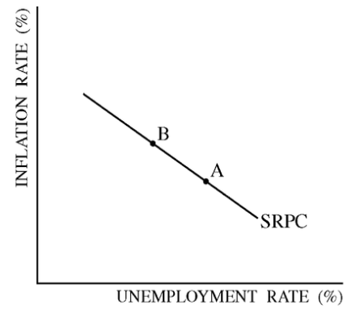

# Question 1 (c)

  
  
  

# Question 2 (a)

  -   Total change in reserves = The change of government securities

# Question 2 (b)

  -   Money supply is vertical, since it is controlled by the federal
      bank

  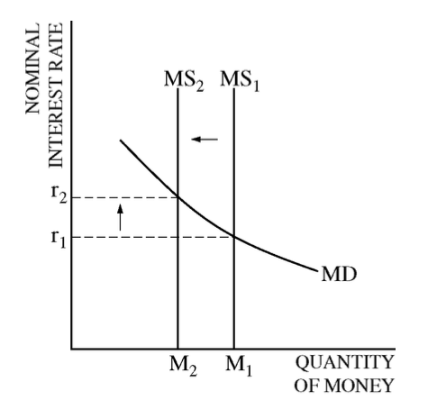

# Question 3 (a)

  
  
  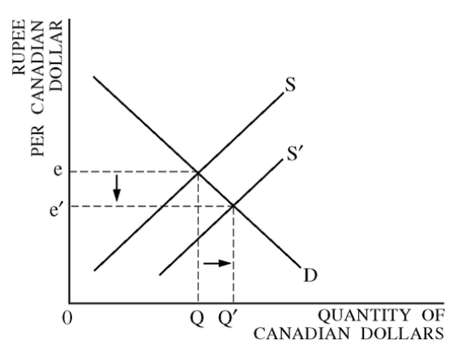

  -   The supply of Canadian dollars will increase, because Canadian
      investors will be attracted by the higher real interest rate in
      India and increase their purchase of Indian financial assets

  ![The demand for currency The demand for currencies is derived from
  the demand for a country's exports, and from speculators looking to
  make a profit on changes in currency values. The supply of currency
  The supply of a currency is determined by the domestic demand for
  imports from abroad. For example, when the UK imports cars from Japan
  it must pay in yen (Y), and to buy yen it must sell (supply) pounds.
  The more it imports the greater the supply of pounds onto the foreign
  exchange market. A large proportion of short-term trade in currencies
  is by dealers who work for financial institutions. The London foreign
  exchange market is the World's single largest international exchange
  market. ](./media/image209.png)

# Question 3 (b)

  
  
  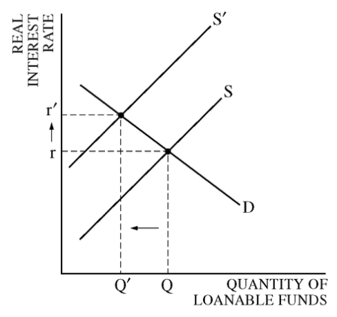

 

 

2010 Multiple Choice

2017年5月3日 星期三

下午1:22

 

# Question 25

  -   Leakage and injections of the circular flow

  

# Question 29

  -   Employed
    
      -   people currently **holding a job** in the economy (either
          full-time or part-time)

  -   Unemployed
    
      -   people who are **actively looking for** work but have **not
          found** a job

  -   Labor Force
    
      -   sum of **employed** and **unemployed **

# Question 30

  
  
  

# Question 34

  

# Question 36

  -   Current account vs. Capital account

  ![The current account records exports and imports of goods and
  services as well as unilateral • transfers whereas the capital account
  records transactions of purchase and sale of foreign assets and
  liabilities during a particular year. The current account considers
  goods and services currently being produced. The credit and debit of
  foreign exchange due to these transactions are also recorded in the
  balance of current account. The capital account is concerned with
  payments of debts and claims, regardless of the time period. The
  balance of capital account includes all items reflecting changes in
  stocks. The balance of payments contains two accounts: current and
  capital. The current account deals with short-term transactions known
  as actual transactions as they have a real impact on income, output
  and employment levels of a country through the movement of goods and
  services in the economy. It is comprised of visible trade (export and
  import of goods), invisible trade (export and import of services),
  unilateral transfers and investment income (income from factors such
  as land or foreign shares). The resulting balance of the current
  account is approximated as the sum total of balance of trade. The
  capital account is a record of the inflows and outflows of capital
  that directly affect a country's foreign assets and liabilities. It is
  concerned with all international trade transactions between citizens
  of a given country and citizens in other countries. The components of
  the capital account include foreign investment and loans, banking
  capital and other forms of capital, as well as monetary movements or
  changes in foreign exchange reserve. The capital account flow reflects
  factors such as commercial borrowings, banking, investments, loans and
  capital. In economic terms, the current account deals with receipt and
  payment in cash as well as non- capital items, and the capital account
  reflects sources and utilization of capital. The sum of the current
  account and capital account as reflected in the balance of payments
  will always be zero; any surplus or deficit in the current account is
  matched and cancelled out by an equal surplus or deficit in the
  capital account. ](./media/image216.png)

# Question 41

  ![41. If the economy was in a severe recession, the most expansionary
  fiscal policy would be to (A) decrease both personal income taxes and
  government spending by equal amounts (B) decrease both the reserve
  requirement and government spending by the same proportion (C)
  decrease personal income taxes and increase overnments ndin b ual
  amounts (D) increase the money supply and increase government spending
  by the same proportion Increase socra security taxes an Increase
  government spending by equal amounts ](./media/image217.png)

# Question 43

  -   Bond Prices and Nominal Interest Rates go the opposite direction

  

# Question 45

  ![Supply and Demand and Exchange Rates • If Americans want to buy
  foreign goods/services then they need the currency that the people in
  the foreign country use from day to day. • If Foreigners want to buy
  American made goods/services, then they need the currency that people
  in the U.S. use from day to day. — This currency exchange MUST be made
  somewhere along the process of trade\!\! Currency (money) is a
  commodity just like any other good/service — its value is determined
  by the forces of supply and demand — we can't escape it\!\!
  ](./media/image219.png)
  
  ![The Demand and Supply Line-ups in Foreign Exchange Markets Demand
  for the U.S. Dollar Comes from... A U.S. exporting firm that earned
  foreign currency and is trying to pay U.S. -based expenses Foreign
  tourists visiting the United States Foreign investors who wish to make
  direct investments in the U.S. economy Foreign investors who wish to
  make portfolio investments in the U.S. economy Supply of the U.S.
  Dollar Comes from... A foreign firm that has sold imported goods in
  the United States, earned U.S. dollars, and is trying to pay expenses
  incurred in its home country U.S. tourists leaving to visit other
  countries U.S. investors who want to make foreign direct investments
  in other countries U.S. investors who want to make portfolio
  investments in other countries ](./media/image193.png)

# Question 49

  
  
  
  
  

# Question 53

  ![Full Employment Aggregate Supply Aggregate Demand GROSS DOMESTIC
  PRODUCT 60. The economy of a country is currently in equilibrium at
  point A in the diagram above. If the government does nothing and wages
  are flexible, which of the following will most likely occur in the
  long run? (A) Falling wages will shift the aggregate demand curve to
  the right, producing full employment. (B) Rising wages will shift the
  aggregate demand curve to the right, producing full employment. (C)
  The economy will remain at point A. (D) Rising wages will shift the
  aggregate supply curve to the right, producing full em 10 ment. (E)
  Falling wages will shift the aggregate supply curve to the right,
  producing full employment. ](./media/image223.png)

  -   Short-Run to Long-Run: Y1 \> YP

  -   Initial equilibrium is E1. Eventually, **low
      unemployment** will cause **nominal wages** to **rise** and leads
      to a **leftward** shift of the **SRAS curve**, so the new
      equilibrium is at E2

  

  -   Short-Run to Long-Run: Y1 \< YP

  -   Initial equilibrium is E1. Eventually, **high
      unemployment** will cause **nominal wages** to **fall** and leads
      to a **rightward** shift of the **SRAS curve**, so the new
      equilibrium is at E2

  

 

 

2012 Multiple Choice

Tuesday, April 4, 2017

10:14 PM

 

# Question 9

  -   The official unemployment rate understates the unemployment level
      in the economy because the official unemployment rate ignores
      underemployed and discouraged workers

# Question 12

  

# Question 28

  -   Technology in output per worker

  

# Question 30

  
  
  

# Question 32

  

# Question 33

  

# Question 34

  -   Unanticipated inflation increases the economic well-being of net
      debtors

# Question 35

  -   Inflationary expectations --\> inflation --\> unemployment

  

# Question 37

  -   Wage-Price Spiral: Combination of **"cost-push"** and
      **"demand-pull"** inflation leads to a wage-price spiral

  -   When there is **too much money** chasing too few goods, the price
      of products will tend to increase which leads to **"demand-pull"**
      inflation

  -   When workers demand **higher wages** as a result of inflated
      prices, prices of products consequently go up as well, leading to
      this "**wage-price**" spiral

  -   **Increased price of products leads to higher wages leads to
      increased price of products and so on**

  -   Keynesians tend to favor this model of how inflation works and
      that they prices are sticky downward or downward inflexible

  

# Question 38

  
  
  

# Question 40

  
  
  

# Question 49

  

# Question 50

  ![Exhibit 5: Production (and Consumption) Possibilities Frontiers with
  Trade (a} United States U.S. preferred combination 400 300 200 100 0
  100 200 300 400 Clothing 400 300 200 100 (b) \[zodia Izodian preferred
  combination 1 0 100 200300400 Clothing + The U.S. consumption
  possibilities frontier stops at 400 million units Of clothing because
  that is the most that Izodians can produce \*With production and
  specialization, the U.S. produces 600 units Of food, consumes 400
  units, and exchanges the rest for 200 million units of Izodian
  clothing. \*Izodians produce 400 units of clothing, wear 200 million
  units, and exchange the rest for 200 million units of U.S. food
  ](./media/image234.png)

# Question 54

  -   An increase in the labor force would LEAST likely increase labor
      productivity.

# Question 59

  -   Advocates of a monetary rule recommend increasing the money supply
      at a rate that is equal to the rate of increase in long-run real
      GDP

# Question 60

  -   Most economists believe that in the **long-run**, there is **no
      trade-off** between unemployment and inflation

  -   To **avoid accelerating inflation** overtime, the **unemployment**
      rate must be **high enough** that the **actual rate** of inflation
      **matches** the **expected rate** of inflation

  -   The **unemployment rate** at which inflation does **not change**
      over time is known as the **nonaccelerating inflation rate of
      unemployment**, or **NAIRU**

  -   The Long-Run Phillips Curve (**LRPC**) is the relationship between
      **unemployment** and **inflation after expectations** of
      unemployment have had **time to adjust** over time

 

 

2012 Free Response

Thursday, April 13, 2017

9:29 PM

 

# Question 1 (a)

  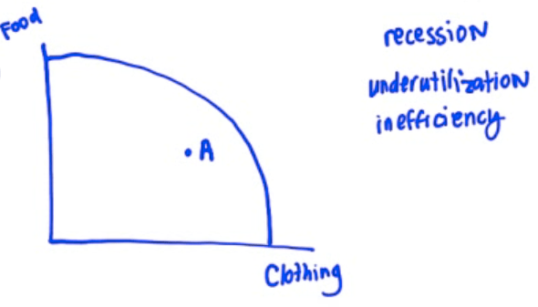
  
  

# Question 1 (b)

  -   Label the x-axis as "Quantity of Money"

  -   Use MS, MD instead of S, D to represent money supply and money
      demand

  -   MD could be a straight line or a inside-curved line

  -   Label r1, r2 and M1, M2

  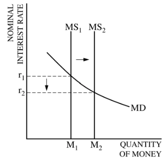

  -   Real interest rate = nominal interest rate - inflation

  -   No change to the price level --\> inflation = 0

  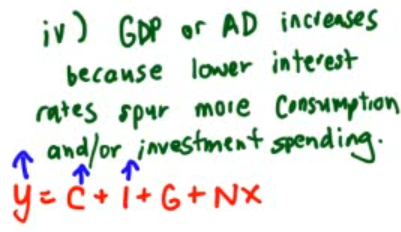

# Question 1 (c)

  -   Current Account
    
      -   Balance of payments on **goods** and **services** plus **net
          international transfer payments** and **factor income**
    
      -   **Sales and purchases of goods and services**
        
          -   Payments from foreigners: $2,000,000
        
          -   Payments to foreigners: $2,500,000
        
          -   Net: -$500,000
    
      -   **Factor Income**
        
          -   Payments from foreigners: $800,000
        
          -   Payments to foreigners: $600,000
        
          -   Net: $200,000
    
      -   **International Transfers**
        
          -   funds sent by residents of one country to residents of
              another
        
          -   Net: -$100,000
    
      -   **Current Account (CA) = Net foreign sales of goods and
          services + net factor income + net international transfer** =
          -500,000 + 200,000 - 100,000 = -400,000
    
      -   Current account deficit: CA \< 0
    
      -   Current account surplus: CA \> 0
    
      -   Another Example

  
  
   
  
  

# Question 2 (b)

  -   M1 = Currency + Checkable
  deposits

  

  -   Assets = Liabilities

  -   Withdrawal will change the required reserves, thus changing the
      excess reserves

  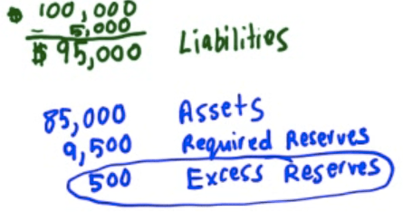

# Question 2 (c)

  -   Bank can borrow from the **Federal Reserve** or from **another
      bank** if it runs out of money

# Question 3 (a)

  -   x-axis: Real GDP or Y

  -   y-axis: (Aggregated)Price Level

  

# Question 3 (b)

  -   Increase in exports will shift the AD to the right

  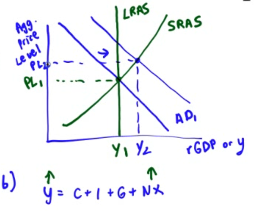

# Question 3 (c)

  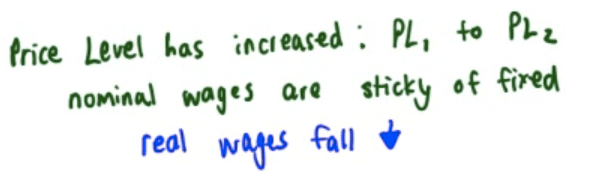

# Question 3 (d)

  
  
  
  
  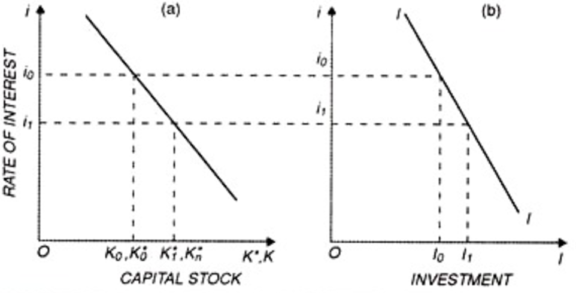
  
  

 

 

2013 Free Response

Thursday, April 13, 2017

10:04 PM

 

# Question 1 (b)

  -   Graph of the money market vs Graph of the loanable funds market

  

  -   Graph of the loanable funds market

  -   x-axis: Quantity of Loanable Funds

  -   y-axis: Real Interest Rate

  

# Question 1 (c)

  -   More investment, higher GDP growth rate

  

# Question 1 (d)

  -   Foreign exchange market for the euro

  -   x-axis: Quantity of Euro

  -   y-axis: Dollar per Euro

  -   Label e on the y-axis as exchange rate

  

  -   The demand for the euro increases because the higher real interest
      rate in the euro zone leads to higher returns for financial
      **investments** in the euro zone, **attracting funds** from the
      United States to the euro zone.

# Question 1 (e)

  -   Current Account
    
      -   Depreciate = Deficit
    
      -   Appreciate = Surplus

  
  
  ![Table 12015 balance of payments (billions of dollars) Current
  account Gross exports (goods and services) Gross imports (goods and
  services) Net income New current transfers Current account balance
  Capital and financial account Capital account Financial account,
  excluding net reserve assets Financial account, reserve assets
  Financial account Capital and financial account balance Net errors and
  omissions Balance of payments (current account + capital and financial
  account + net errors and omissions) Sources: Wind, SAFE $2, 375 $2,007
  -$9 -$16 So $343 -$161 $293 -$161 -$132 So ](./media/image252.png)
  
  ![Political Stability and Economic Performance Inflation Differentials
  Interest Rate Differentials Current Account Balances Public Debt
  Balances Investors inevitably seek out stable countries with strong
  economic performance to invest capital Countries with lower inflation
  tend to have stronger currencies as purchasing power increases
  relative to other currencies Higher interest rates attract foreign
  capital and therefore cause currencies to appreciate Countries with
  current account deficits tend to have weaker currencies Countries with
  large public debts are less attractive to foreign investors, large
  debt encourages inflation ](./media/image253.png)

# Question 2 (e)

  

  -   SRAS will increase because wages and some other production costs
      decrease during a recession

  
  
  

# Question 3 (a)

  -   x-axis: Unemployment rate

  -   y-axis: Inflation rate

  

# Question 3 (e)

  -   Real Interest Rate = Nominal Interest Rate - **EXPECTED**
      Inflation Rate

 

 

2014 Free Response

2017年4月24日 星期一

下午2:31

 

# Question 1 (b)

  -   **Increase** in government **spending** will **reduce** the
      **Cyclical** Unemployment and have **no effect** on the **Natural
      Rate** of Unemployment

  -   Cyclical Unemployment

  ![Cyclical Unemployment • • eve When the economy goes into a recession
  and tota output falls, the unemployment rate rises Since it arises
  from conditions in the overall economy, cyclical unemployment is a
  problem for macroeconomic policy It is caused by the business cycle
  hence called 'cyclical' Macroeconomists say we have reached full
  employment when cyclical unemployment is reduced to zero But the
  overall unemployment rate at full employment is greater than zero
  Because there are still positive levels of frictional, seasonal, and
  structural unemployment ](./media/image257.png)

  -   Natural rate of unemployment

  ![RELATIONSHIPS BETWEEN THE TYPES OF UNEMPLOYMENT NATURAL UNEMPLOYMENT
  = FRICTIONAL UNEMPLOYMENT + STRUCTURAL UNEMPLOYMENT ACTUAL
  UNEMPLOYMENT CYCLICAL UNEMPLOYMENT NATURAL UNEMPLOYMENT + The NRU is
  also called the full employment rate of unemployment. Full employment
  does not mean zero unemployment. It is reached when labor rnarkets are
  in balance; the number of job seekers equals the number of job
  vacancies. At this point the economy's potential output is being
  achieved. The natural rate of unemployment is not fixed; it changes
  over time and is affected by economic policies.
  ](./media/image258.png)

# Question 1 (d)

  -   The effect of increase in government spending on the real interest
      rate
    
      -   **Upward-sloping Supply**
    
      -   Downward-sloping Demand
    
      -   Increase in Demand ≈ Decrease in Supply

  

# Question 1 (e)

  -   The economic growth rate will fall with higher interest rate,
      because it will **slow down capital formation**

# Question 2 (a)

  -   Buy bonds --\> Shift demand of bonds to the right --\> Increase
      the price of bonds

  

# Question 2 (b)

  -   Label MS and MD instead of S and D for graph of the money market

  -   **NOMINAL** interest rate at the y-axis

  

# Question 2 (d)

  -   Discount rate
    
      -   The interest rate that the Federal Reserve charges banks for
          borrowing from its discount window

  
  
  

# Question 3 (a)

  -   If inflation does fall then there will be other benefits from
      having a low inflation rate such as:
    
      -   More competitive exports (UK goods rise less than other
          countries)
    
      -   More certainty and less confusion encouraging investment
    
      -   Lower menu costs (though quite insignificant at the moment)

# Question 3 (b)

  -   Import \> Export --\> Current Account Deficit

  -   Import \< Export --\> Current Account Surplus

  

  -   Y=C+I+G+NX
    
      -   Higher US exports increased AD
    
      -   Production increases to meet the increased export demand from
          other countries

# Question 3 (c)

  -   Lower inflation rate for US dollar --\> Higher demand for US
      dollar

  

 

 

2015 Free Response

2017年4月24日 星期一

下午2:31

 

# Question 1 (d)

  -   Spending Multiplier
    
      -   **Minimum required change in government spending = Value of
          recessionary gap / Spending Multiplier **

  

  -   The minimum required change in taxes will be greater than the
      minimum required change in government spending.

  -   The **tax multiplier** (mpc/mps = 0.8/0.2 = 4) is **smaller** than
      the government **spending multiplier** (1/mps = 1/0.2 = 5) because
      part of the initial increase in disposable income caused by the
      decrease in income tax will be saved rather than spent.

# Question 1 (e)

  -   Lower income tax rate --\> More **disposable income** --\> More
      **consumption** and **investment** --\> Increase in Aggregate
      Demand

# Question 3 (a)

  -   Foreign exchange market for the euro

  

  -   The supply of Euro in the foreign exchange market will increase
      because when real interest rates in Japan increased, people with
      euros will want to **invest in Japan's financial assets** because
      they will see a **high return**.

  -   To purchase Japan's financial assets, they will demand yen from
      the foreign exchange market, leaving behind euro.

 

 

2016 Free Response

2017年4月24日 星期一

下午2:31

 

# Question 1 (a)

  -   Phillips Curve
    
      -   x-axis: unemployment rate
    
      -   y-axis: inflation rate (Since i**nflation rate could be
          negative**)
    
      -   LRPC = NAIRU = Non-Accelerating Inflation Rate of Unemployment

  

# Question 1 (d)

  -   Open Market Operation and Federal Funds Rate
    
      -   To **Bloat** the economy --\> **Buy** bonds --\> Increase in
          Money Supply --\> Increase reserve --\> **Decrease** Federal
          Funds Rate
    
      -   To **Shrink** the economy --\> **Sell** bonds --\> Decrease in
          Money Supply --\> Decrease reserve --\> **Increase** Federal
          Funds Rate

  

# Question 1 (e)

  -   The effect of expansionary monetary policy on GDP

  ![Figure 15.7 Monetary policy (1 of 2) The Fed conducts expansionary
  monetary policy when it takes actions to decrease interest rates to
  increase real GDP. This works because decreases in interest rates
  raise consumption, investment, and net exports. The Fed would take
  this action when short-run equilibrium real GDP was below potential
  real GDP. The increase in aggregate demand encourages increased
  employment, one of the Fed's primary goals. Copyright @ 2017 Pearson
  Education, Inc \_ All Rights Reserved Long•run causes SHAS A 02 Real
  GOP Expmi—y PEARSON ](./media/image270.png)
  
  

# Question 1 (g)

  -   The effect of change in interest rate on foreign exchange market

  

# Question 2 (c)

  ![Review • Dollar value of Required Reserves = Amount of deposit X
  required reserve ratio • Excess Reserves = Total Reserves — Required
  Reserves • Maximum amount a single bank can loan = the change in
  excess reserves caused by a deposit • The money multiplier =
  l/required reserve ratio • Total Change in Loans = amount single bank
  can lend X money multiplier • Total Change in the money supply = Total
  Change in Loans + $ amount of Fed action • Total Change in demand
  deposits = Total Change in Loans + any cash deposited
  ](./media/image273.png)

  -   If Mr. Smith deposits $100 in the bank and $10 is kept in reserves
      then $90 can be loaned out.

  -   If that $90 is deposited in another bank then 10% of the $90 or $9
      must be kept in reserve and therefore $81 can then be loaned out
      in the next round and 10% of that must be kept in reserve and so
      on and so on and so on. Until all is loaned out.

# Question 2 (d)

  -   The **original** $100 was already part of the money supply so you
      **can't include** that in the calculation.

 

 

Practice Exam Multiple Choice

Monday, April 10, 2017

11:23 PM

 

# Question 6

  -   Purchase bond --\> decrease the interest rate

  

  -   Purchase bond --\> bloat the economy = increase the inflation rate
      --\> promote the employment

# Question 7

  -   Investment tax credits

  
  
  

# Question 10

  -   Consumer Price Index and Inflation

  
  
  ![We can then use the monthly CPI published by the Bureau of Labor
  Statistics to determine differences between two points in time and
  calculate inflation for that period. For example, let's compare the
  CPI of January 2000 with that of January 2010. The CPI of January 2000
  was 168.800 with the index for January 2010 listed as 216.687. To make
  the calculations, we take the more recent CPI, subtract the oldest
  CPI, and then divide by the oldest CPI. Using our numbers shown above,
  it would be 216.687, minus 168.800, divided by 168.800. This equals
  .2837. Inflation is always considered as a percentage, so we take that
  number and multiply it by 100 toget 28.37%. Thus, the inflation rate
  from January 2000 to January 2010 was 28.37%. By looking at these
  calculations, it becomes easier to understand that the Consumer Price
  Index is a factor in determining inflation.
  ](./media/image278.png)

# Question 12

  
  
  
  
  

# Question 25

  -   Budget deficit and interest rate

  
  
  

# Question 26

  

  -   Increasing household income in the U.S. results in more demand for
      foreign goods which appreciates that currency and depreciates the
      dollar.

# Question 27

  -   Causes of Stagflation
    
      -   If the prices of raw material and labour increases, it will
          increase the cost of production prices will rise and output
          will fall.
    
      -   Rapid rise in indirect taxes also increase the cost and price
          level. So output and employment falls.
    
      -   Shortage of labour also affects the output adversely.

  
  
  

# Question 34

  

  -   Alpha is getting 1 S domestically for their 1 G, but now they can
      trade their 1 G for 1.5 S.

  -   Beta is having to give up 2 S to get 1 G domestically, but if they
      trade they only have to give up 1.5 S to get 1 G.

# Question 35

  ![From the Short Run to the Long Run Aggregate price level (a)
  Leftward Shift of the Short-Run Aggregate Supply Curve LUS SRAS2 SRASI
  A rise in nominal wages shifts SRAS leftward. Real GDP Aggregate price
  level (b) Rightward Shift of the Short-Run Aggregate Supply Curve susl
  SRAS2 A fall in nominal wages shifts SRAS righ tward. Real GDP In
  panel (a), the initial short-run aggregate supply curve is SRA\*. At
  the aggregate price level, PI, the quantity of aggregate output
  supplied, Yl, exceeds potential output, Yp. Eventually, low unem-
  ployment will cause nominal wages to rise, leading to a leftward shift
  of the short-run aggregate supply curve from SRA\* to SRA$. In panel
  (b), the reverse happens: at the aggregate price level, PI, the
  quantity of aggregate output supplied is less than po- tential output.
  High unemployment eventually leads to a fall in nominal wages over
  time and a rightward shift of the short-run ag- gregate supply curve.
  ](./media/image286.png)

  -   Short-Run to Long-Run: Y1 \> YP
    
      -   Initial equilibrium is E1. Eventually, **low
          unemployment** will cause **nominal wages** to **rise** and
          leads to a **leftward** shift of the **SRAS curve**, so the
          new equilibrium is at E2

  

  -   Short-Run to Long-Run: Y1 \< YP
    
      -   Initial equilibrium is E1. Eventually, **high
          unemployment** will cause **nominal wages** to **fall** and
          leads to a **rightward** shift of the **SRAS curve**, so the
          new equilibrium is at E2

  

# Question 37

  
  
  
  
  

# Question 40

  

  -   Expansionary monetary policy would result in lower interest rates,
      causing more investment in real capital.

  -   To keep prices from going up, policymakers could cut G or raise
      taxes \[contractionary\] to prevent this.

# Question 42

  -   Lower production costs --\> more profits + shifts the AS to the
      right --\> lower price level + increase in real output

# Question 43

  
  
  With no intervention in this recession, the surpluses would result in
  lower prices

  -   Workers would then accept lower wages. As more are hired back,
      output would increase.

# Question 47

  -   Decreasing taxes would increase C, increase AD and real GDP.
      Assuming a balanced budget before the decrease in T means the G
      would have to borrow, pushing up interest rates.

  -   Decreasing the discount rate would also lead to more real GDP but
      would result in a lower interest rate.

  -   With interest rates moving in opposite directions with the two
      policies, this make them indeterminate.

  

# Question 53

  

  -   The decrease in AD resulted in surpluses & caused prices to drop.

  -   Workers would now accept lower wage increases which moved the SRAS
      curve right, increasing real GDP.

  
  
  

# Question 56

  ![Gross Private Domestic Investment (I) I = the purchase of new
  capital goods or total investment by the private sector. It includes
  the purchase of new housing, plants, equipment, & inventory by the
  private sector. Nonresidential investment includes expenditures by
  firms for machines, tools, plants. Residential investment includes
  expenditures by households & firms on new houses. Change in
  inventories computes the amount by which firms' inventories change
  during a given period. Inventories are the goods that firms produce
  now but intend to sell later. ](./media/image291.png)

# Question 57

  -   The Relationship Between the Phillips Curve and AD

  
  
  ![The Phillips curve shows the inverse trade-off between rates of
  inflation and rates of unemployment. If unemployment is high,
  inflation will be low; if unemployment is low, inflation will be high.
  The Phillips curve and aggregate demand share similar components. The
  Phillips curve is the relationship between inflation, which affects
  the price level aspect of aggregate demand, and unemployment, which is
  dependent on the real output portion of aggregate demand.
  Consequently, it is not far-fetched to say that the Phillips curve and
  aggregate demand are actually closely related. To see the connection
  more clearly, consider the example illustrated by . Let's assume that
  aggregate supply, AS, is stationary, and that aggregate demand starts
  with the curve, ADI. There is an initial equilibrium price level and
  real GDP output at point A. Now, imagine there are increases in
  aggregate demand, causing the curve to shift right to curves AD2
  through AD4. As aggregate demand increases, unemployment decreases as
  more workers are hired, real GDP output increases, and the price level
  increases; this situation describes a demand-pull inflation scenario.
  ](./media/image293.png)
  
  

# Question 59

  -   Business taxes are determinants of both AD and AS.

  -   The decrease in business taxes means they have more profits and
      will invest more, increasing AD.

  -   As far as the legal-institutional environment with the government,
      it is more favorably so that will result in an increase in AS

# Question 60

  -   The budget deficit means the government is borrowing more, which
      pushes up the interest rate.

  -   The higher interest rate attracts more foreign investors,
      increasing demand for the dollar and appreciating the dollar.

  -   The stronger dollar makes our exports more expensive and imports
      cheaper, therefore increasing the trade deficit.

  
