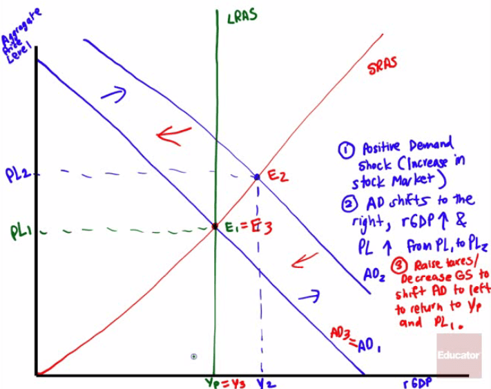
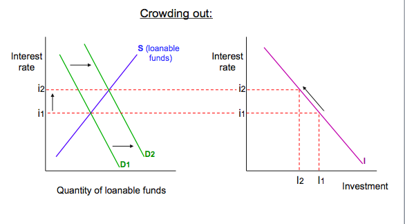
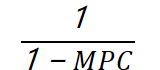
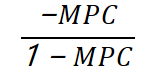

<a href="./exams/Sample Questions.pdf"  target="_blank" >Sample Questions</a>

# Question 1 

  -   **Labor-hours is the input NOT the output **

<table>
<thead>
<tr class="header">
<th>Labor-hours</th>
<th>Fish</th>
<th>Wheat</th>
</tr>
</thead>
<tbody>
<tr class="odd">
<td>Country A</td>
<td>10</td>
<td>20</td>
</tr>
<tr class="even">
<td>Country B</td>
<td>20</td>
<td>60</td>
</tr>
</tbody>
</table>

  -   Convert to the **quantity of outputs**, assuming the labor-hours
      is 60

<table>
<thead>
<tr class="header">
<th>Quantity</th>
<th>Fish</th>
<th>Wheat</th>
</tr>
</thead>
<tbody>
<tr class="odd">
<td>Country A</td>
<td>6</td>
<td>3</td>
</tr>
<tr class="even">
<td>Country B</td>
<td>3</td>
<td>1</td>
</tr>
</tbody>
</table>

  -   Country A has CA in wheat

  -   Country B has CA in fish

# Question 3

  -   In a **inflationary** gap, the following occurs
    
      -   An initial **positive demand shock** (**real estate market
          booms**)
    
      -   **AD** shifts to the **right**, and so the aggregate price
          level and aggregate output increase, which leads to **higher
          inflation** in the short-run and **reduces unemployment**
    
      -   Eventually, an **increase** in nominal **wages** in the long
          run **decreases** the **SRAS** and **moves** the economy
          **back to potential output**

  

  -   **Contractionary Fiscal Policy**
    
      -   Use **contractionary** fiscal policy to **decrease aggregate
          demand** in order to get the economy **back to** its
          **potential output**
        
          -   Decrease government spending (direct impact)
        
          -   Increase taxes
        
          -   Decrease in government transfers
    
      -   Graph

  

# Question 4

  -   Crowding-out effect
    
      -   When the **government borrows funds** in the financial
          markets, it competes with **private firms** and "**crowds
          out**" **private spending** by **raising interests rates** and
          **reducing** long-run **economic
growth**

# Question 5

  -   

  -   

  -   MPC + MPS = 1

# Question 6

<table>
<thead>
<tr class="header">
<th>Government Spending</th>
<th>Money Multiplier</th>
<th></th>
</tr>
</thead>
<tbody>
<tr class="odd">
<td>Taxes</td>
<td>Tax Multiplier</td>
<td></td>
</tr>
</tbody>
</table>

  -   When raising government spending and the taxes by the same amount,
      the **impact** of **government spending** will be **greater** than
      that of
  taxes

# Question 7

  

<table>
<thead>
<tr class="header">
<th>Expansionary Monetary Policy</th>
<th>Contractionary Money Policy</th>
</tr>
</thead>
<tbody>
<tr class="odd">
<td><ul>
<li><blockquote>

<strong>Lower Discount Rate</strong>

</blockquote></li>
</ul></td>
<td><ul>
<li><blockquote>

<strong>Raise Discount Rate</strong>

</blockquote></li>
</ul></td>
</tr>
<tr class="even">
<td><ul>
<li><blockquote>

<strong>Lower RRR</strong>

</blockquote></li>
</ul></td>
<td><ul>
<li><blockquote>

<strong>Raise RRR</strong>

</blockquote></li>
</ul></td>
</tr>
<tr class="odd">
<td><ul>
<li><blockquote>

<strong>Buy</strong>/<strong>Bloat</strong> Government Securities After Lowering Target Fed Funds Rate 
(<strong>Open Market Operation</strong>)

</blockquote></li>
</ul></td>
<td><ul>
<li><blockquote>

<strong>Sell</strong>/<strong>Shrink</strong> Government Securities After Raising of Target Fed Funds Rate 
(<strong>Open Market Operation</strong>)

</blockquote></li>
</ul></td>
</tr>
</tbody>
</table>

# Question 9

  -   **Expansionary monetary policy → r↓**

  

  -   **Expansionary Fiscal Policy → Spend more money → Crowding-out
      effect → r↑ **

  

  -   Expansionary policy will **shift AD** to the **right**,
      **increase** the **GDP**, therefore **unemployment** will
      **decrease**

# Question 10

  -   **Sell securities = Shrink money supply = decrease total loans by
      banks**

# Question 11

  -   If the **reserve ratio** is **low**, **more money** circulate, so
      Fed will have **more effect** on rGDP

# Question 12

  -   **Labor productivity↑ → AS↑ → Price Level↓ & rGDP↑**

  

# Question 14

  -   Phillips curve
    
      -   x-axis: unemployment rate
    
      -   y-axis: inflation rate

  -   Short-run Phillips curve

  

  -   Long-run Phillips curve

  

  -   In short-run
    
      -   **High inflation rate, low unemployment rate**
    
      -   **Low inflation rate, high unemployment rate**

# Question 16

![Factors that Shift the Short-Run Aggregate Supply Curve Changes in
commodity prices If commodity prices fall, If commodity prices rise,
Changes in nominal wages If nominal wages fall, If nominal wages rise, .
Changes in productivity If workers become more productive, . If workers
become less productive, . ... short-run aggregate supply increases. ...
short-run aggregate supply decreases. ... short-run aggregate supply
increases. ... short-run aggregate supply decreases. ... short-run
aggregate supply increases. ... short-run aggregate supply decreases.
](./media/image25.png)

# Question 17

  -   The equation of exchange
    
      -   **MV = PY**
    
      -   **Expenditure = nominal GDP**
    
      -   M: money supply
    
      -   V: velocity of circulation
    
      -   P: price level
    
      -   Y: real GDP

  -   Velocity of circulation
    
      -   the average number of times each dollar is spent on final
          goods and services

# Question 18

<table>
<thead>
<tr class="header">
<th></th>
<th>Expansionary fiscal policy</th>
<th>Contractionary monetary policy</th>
</tr>
</thead>
<tbody>
<tr class="odd">
<td>GDP</td>
<td>↑</td>
<td>↓</td>
</tr>
<tr class="even">
<td>Unemployment</td>
<td>↓</td>
<td>↑</td>
</tr>
<tr class="odd">
<td>Interest rate</td>
<td>↑</td>
<td>↑</td>
</tr>
</tbody>
</table>

# Question 19

  -   **Supply of money ↑ = Value of money ↓ = Exports ↑**

# Question 20

  -   

  -   Inflation rate \> 0: inflation

  -   Inflation rate < 0: deflation